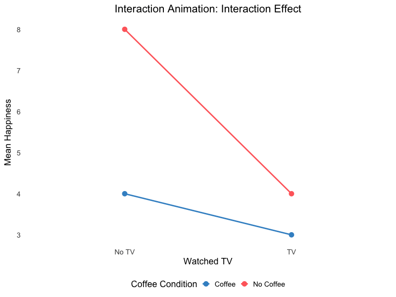

```{r}
#| include: false
library(dplyr)
library(ggplot2)
library(tibble)
library(tidyr)
library(broom)
library(gt)
library(afex)

# Site tokens (see custom.scss / DESIGN_SYSTEM.md)
sage  <- "#5C715E"  # $accent
sage2 <- "#8FAF9E"  # $accent2
sage3 <- "#A7C7B5"  # $accent3
ink   <- "#2F3E46"  # $body-color
hot   <- "#B5483B"  # "look here" highlight
amber <- "#E8A33D"
two   <- c(sage, amber)

theme_deck <- function(base_size = 22) {
  theme_minimal(base_size = base_size) +
    theme(
      panel.grid.minor = element_blank(),
      panel.grid.major.x = element_blank(),
      axis.title = element_text(color = ink),
      axis.text = element_text(color = ink),
      plot.title = element_text(color = ink, face = "bold"),
      legend.text = element_text(color = ink),
      legend.position = "top"
    )
}

f2 <- function(x) formatC(x, format = "f", digits = 2)
f3 <- function(x) formatC(x, format = "f", digits = 3)
fp <- function(p) ifelse(p < .001, "< .001", paste("=", sub("^0", "", sprintf("%.3f", p))))
# pull one row of a tidy ANOVA table
row_of <- function(tab, term) tab[tab$term == term, ]
apa_F <- function(tab, term) {
  r <- row_of(tab, term); e <- row_of(tab, "Residuals")
  sprintf("F(%d, %d) = %s, p %s", r$df, e$df, f2(r$statistic), fp(r$p.value))
}
pEta <- function(tab, term) {
  r <- row_of(tab, term); e <- row_of(tab, "Residuals")
  r$sumsq / (r$sumsq + e$sumsq)
}

# ---- Running example: Coffee x TV (the same cell means as the animation) ----
means <- tribble(
  ~TV,      ~Coffee,       ~Happiness,
  "TV",     "Coffee",       3,
  "TV",     "No Coffee",    4,
  "No TV",  "Coffee",       4,
  "No TV",  "No Coffee",    8
) |>
  mutate(TV = factor(TV, levels = c("TV", "No TV")),
         Coffee = factor(Coffee, levels = c("Coffee", "No Coffee")))
coffee_marg <- means |> group_by(Coffee) |> summarise(M = mean(Happiness))
tv_marg     <- means |> group_by(TV) |> summarise(M = mean(Happiness))

# ---- Example 1: gender x education, political interest (interaction) ----
set.seed(123)
twoway <-
  tibble(
    id = 1:100,
    gender = sample(c("Male", "Female"), 100, replace = TRUE),
    education_level = sample(c("High School", "Bachelor's", "Master's", "PhD"), 100, replace = TRUE)
  ) |>
  mutate(
    edu_num = case_when(education_level == "High School" ~ 1,
                        education_level == "Bachelor's" ~ 2,
                        education_level == "Master's" ~ 3,
                        education_level == "PhD" ~ 4),
    political_interest = 5 + edu_num * 1.2 +
      if_else(gender == "Female", edu_num * 0.8, edu_num * -0.5) +
      rnorm(100, mean = 0, sd = 1),
    education_level = factor(education_level,
                             levels = c("High School", "Bachelor's", "Master's", "PhD"))
  )
tab_pol <- aov_ez("id", "political_interest", twoway,
                  between = c("gender", "education_level"), return = "aov") |>
  tidy()

# ---- Example 2: diet x exercise, weight loss (no interaction) ----------
set.seed(42)
wl <- expand.grid(
  diet_type = c("Low Carb", "Low Fat"),
  exercise_regimen = c("Cardio", "Strength"),
  id = 1:25
) |>
  mutate(weight_loss = case_when(diet_type == "Low Carb" ~ 6, diet_type == "Low Fat" ~ 4) +
           case_when(exercise_regimen == "Cardio" ~ 5, exercise_regimen == "Strength" ~ 3) +
           rnorm(n(), mean = 0, sd = 1.5))
fit_wl <- aov(weight_loss ~ diet_type * exercise_regimen, data = wl)
tab_wl <- tidy(fit_wl)
cells_wl <- wl |> group_by(diet_type, exercise_regimen) |>
  summarise(M = mean(weight_loss), SD = sd(weight_loss), .groups = "drop")
diet_marg <- wl |> group_by(diet_type) |> summarise(M = mean(weight_loss), SD = sd(weight_loss))
ex_marg   <- wl |> group_by(exercise_regimen) |> summarise(M = mean(weight_loss), SD = sd(weight_loss))

# Pretty ANOVA table
anova_gt <- function(tab, fn = NULL) {
  out <- tab |>
    mutate(p.value = ifelse(is.na(p.value), NA, ifelse(p.value < .001, "<.001", sprintf("%.3f", p.value)))) |>
    rename(Source = term, SS = sumsq, MS = meansq, `F` = statistic, p = p.value) |>
    gt() |>
    fmt_number(columns = c(SS, MS, `F`), decimals = 2) |>
    fmt_number(columns = df, decimals = 0) |>
    sub_missing(missing_text = "--") |>
    tab_style(style = cell_text(weight = "bold"), locations = cells_column_labels()) |>
    opt_row_striping() |>
    cols_align(align = "center") |>
    tab_options(table.width = pct(80), table.font.size = 26)
  if (!is.null(fn)) out <- out |> tab_footnote(footnote = md(fn))
  out
}
```

## What is a Factorial ANOVA?

### More than 1 independent variable

- Up to now, we've looked at experiments that test **one question at a
  time**.

::::::: columns
:::: {.column width="50%"}
::: callout-tip
## t-test

Do **two groups** differ?

*"Does drinking coffee make people happier than not drinking coffee?"*
:::
::::

:::: {.column width="50%"}
::: callout-tip
## One-way ANOVA

Do **more than two groups** differ on one IV?

*"Does coffee make people happier, compared to decaf or water?"*
:::
::::
:::::::

- But in real life, there's *rarely* just one thing influencing
  behavior.

## Why Factorial ANOVA?

A **Factorial ANOVA** allows us to test **more than one independent
variable (IV)** *at the same time.*

- Instead of asking separate questions:

  - "Does coffee make people happier?"

  - "Does watching TV make people happier?"

- We can now ask:

  - "Does coffee *and* watching TV make people happier?"

  - "Does the effect of coffee *depend* on what you're watching?"

## The Power of Two (or More)

### Testing as separate IVs

```{dot}
digraph {
  node [shape = box, style = "rounded,filled", fillcolor = "white", color = "#5C715E", fontname = "Fira Sans"]
  edge [color = "#5C715E"]
  bgcolor = "#E9F1EC"

  subgraph cluster_coffee {
    label = "Independent Variable 1: Coffee"
    bgcolor = "white"
    style = rounded
    color = "#8FAF9E"

    C1 [label="Coffee"]
    C2 [label="No Coffee"]
    H1 [label="Happiness"]
    H2 [label="Happiness"]

    C1 -> H1
    C2 -> H2
  }

  subgraph cluster_tv {
    label = "Independent Variable 2: TV Show"
    bgcolor = "white"
    style = rounded
    color = "#8FAF9E"

    TV [label="TV"]
    NTV [label="No TV"]
    H3 [label="Happiness"]
    H4 [label="Happiness"]

    TV -> H3
    NTV -> H4
  }
}
```

## The Power of Two (or More)

### Combining IVs

```{dot}
digraph {
  node [shape = box, style = "rounded,filled", fillcolor = "white", color = "#5C715E", fontname = "Fira Sans"]
  edge [color = "#5C715E"]
  bgcolor = "#E9F1EC"

  Coffee [label="Coffee"]
  NoCoffee [label="No Coffee"]
  Dark [label="Watch Dark"]
  NoDark [label="No Dark"]

  subgraph cluster_design {
    label = "2 × 2 Factorial Design"
    bgcolor = "white"
    style = rounded
    color = "#8FAF9E"

    CoffeeDark [label="Coffee + Dark"]
    CoffeeNoDark [label="Coffee + No Dark"]
    NoCoffeeDark [label="No Coffee + Dark"]
    NoCoffeeNoDark [label="No Coffee + No Dark"]

    Coffee -> CoffeeDark
    Coffee -> CoffeeNoDark
    NoCoffee -> NoCoffeeDark
    NoCoffee -> NoCoffeeNoDark

    Dark -> CoffeeDark
    Dark -> NoCoffeeDark
    NoDark -> CoffeeNoDark
    NoDark -> NoCoffeeNoDark
  }

  Happiness1 [label="Happiness", style = "rounded,filled", fillcolor = "#DCE8E1"]
  Happiness2 [label="Happiness", style = "rounded,filled", fillcolor = "#DCE8E1"]
  Happiness3 [label="Happiness", style = "rounded,filled", fillcolor = "#DCE8E1"]
  Happiness4 [label="Happiness", style = "rounded,filled", fillcolor = "#DCE8E1"]

  CoffeeDark -> Happiness1
  CoffeeNoDark -> Happiness2
  NoCoffeeDark -> Happiness3
  NoCoffeeNoDark -> Happiness4
}
```

## The Power of Two (or More)

### Three questions at once

:::::: term-list
::: fragment

[Main Effect 1]{.term-pill}

: Does IV1 alone affect the outcome? (Coffee → Happiness)
:::

::: fragment

[Main Effect 2]{.term-pill}

: Does IV2 alone affect the outcome? (TV Show → Happiness)
:::

::: fragment

[Interaction Effect]{.term-pill}

: Does the effect of one variable depend on the other? (Maybe coffee
  *only* helps if you're watching *TV!*)
:::
::::::

## Why Not Just Run Multiple t-tests?

### You could compare...

- Coffee vs. No Coffee

- Dark vs. No Dark

- Coffee + Dark vs. everything else

  - but each additional t-test increases your **Type I error rate**
    (false positives).

- A Factorial ANOVA solves that problem by testing all these
  relationships **in one model**, controlling for shared variance and
  examining combined effects.

## In Other Words...

| Test Type | Question | Example |
|:-----------------------|:-----------------------|:-----------------------|
| **t-test** | Do two groups differ? | Coffee vs. No Coffee |
| **One-Way ANOVA** | Do 3+ groups differ on one IV? | Decaf, Coffee, Energy Drink |
| **Factorial ANOVA** | How do **two or more IVs** work together? | Coffee × TV Show → Happiness |

## The Goal of Research

- The goal of good research is to **narrow in on the real sources of
  variation.**

- Factorial ANOVA lets us see *not just whether variables matter,* but
  *how they matter together.*

> It's not just what causes an effect, it's what combinations of causes
> create patterns we care about.

## Factorial ANOVA

### Four sources of variance

::::::: term-list
::: fragment

[Between IV 1]{.term-pill}

: Variance between the groups of the first IV (main effect 1).
:::

::: fragment

[Between IV 2]{.term-pill}

: Variance between the groups of the second IV (main effect 2).
:::

::: fragment

[Interaction]{.term-pill}

: Variance from the **combination** of the groups (the cells).
:::

::: fragment

[Error]{.term-pill}

: Variance **within** each cell, around that cell's own mean.
:::
:::::::

## Understanding Main Effects

::::: columns
::: {.column width="50%"}
- The **main effect of Coffee** asks:

  - *On average, does drinking coffee make people happier than not
    drinking coffee?*\
    (Regardless of whether they watched *TV* or not.)

- The **main effect of Watching TV** asks:

  - *On average, does watching TV make people happier than not watching
    it?*\
    (Regardless of whether they had coffee or not.)
:::

::: {.column width="50%"}
```{dot}
digraph {
  rankdir = RL
  node [shape = box, style = "rounded,filled", fillcolor = "white", color = "#5C715E", fontname = "Fira Sans"]
  edge [color = "#5C715E"]
  bgcolor = "#E9F1EC"

  subgraph cluster_coffee {
    label = "Independent Variable 1: Coffee"
    bgcolor = "white"
    style = rounded
    color = "#8FAF9E"

    C1 [label="Coffee"]
    C2 [label="No Coffee"]
    H1 [label="Happiness"]
    H2 [label="Happiness"]

    H1 -> C1
    H2 -> C2
  }

  subgraph cluster_tv {
    label = "Independent Variable 2: TV Show"
    bgcolor = "white"
    style = rounded
    color = "#8FAF9E"

    TV [label="TV"]
    NTV [label="No TV"]
    H3 [label="Happiness"]
    H4 [label="Happiness"]

    H3 -> TV
    H4 -> NTV
  }
}
```
:::
:::::

## Understanding Main Effects

### The 2 × 2 table of means

::::: columns
::: {.column width="50%"}
```{r}
#| echo: false
means |>
  pivot_wider(names_from = Coffee, values_from = Happiness) |>
  gt() |>
  cols_label(TV = "Watched TV?") |>
  tab_spanner(label = md("**Coffee condition**"), columns = c(Coffee, `No Coffee`)) |>
  fmt_number(columns = c(Coffee, `No Coffee`), decimals = 1) |>
  tab_header(title = md("**2 × 2 Factorial Design: Coffee × TV**"),
             subtitle = "Mean happiness by condition (cell means)") |>
  tab_style(style = cell_text(weight = "bold"), locations = cells_column_labels()) |>
  tab_options(table.font.size = 28)
```
:::

::: {.column width="50%"}
```{r}
#| echo: false
means |>
  pivot_wider(names_from = Coffee, values_from = Happiness) |>
  mutate(`Row mean` = (Coffee + `No Coffee`) / 2) |>
  bind_rows(tibble(TV = factor("Column mean", levels = c("TV", "No TV", "Column mean")),
                   Coffee = coffee_marg$M[1], `No Coffee` = coffee_marg$M[2],
                   `Row mean` = mean(means$Happiness))) |>
  gt() |>
  cols_label(TV = "Watched TV?") |>
  fmt_number(columns = c(Coffee, `No Coffee`, `Row mean`), decimals = 1) |>
  tab_header(title = md("**With marginal means**"),
             subtitle = "Row and column means show the main effects") |>
  tab_style(style = cell_text(weight = "bold"),
            locations = list(cells_column_labels(),
                             cells_body(rows = TV == "Column mean"),
                             cells_body(columns = `Row mean`))) |>
  tab_options(table.font.size = 28)
```
:::
:::::

- Coffee main effect: `r f2(coffee_marg$M[1])` (coffee) vs.
  `r f2(coffee_marg$M[2])` (no coffee).

- TV main effect: `r f2(tv_marg$M[1])` (TV) vs. `r f2(tv_marg$M[2])` (no
  TV).

## Visualizing Interactions

::::: columns
::: {.column width="50%"}
```{r}
#| echo: false
#| fig-width: 6.5
#| fig-height: 4.4
ggplot(means, aes(TV, Happiness, color = Coffee, group = Coffee)) +
  geom_line(linewidth = 1.6) +
  geom_point(size = 4) +
  scale_x_discrete(limits = c("No TV", "TV")) +
  scale_color_manual(values = two) +
  labs(title = "Interaction plot", x = "Watched TV", y = "Mean happiness", color = NULL) +
  theme_deck(20)
```
:::

::: {.column width="50%"}
- Each line is one level of the first IV (coffee). The x-axis is the second IV (TV).

- **Parallel** lines mean **no interaction**: the effect of one IV doesn't depend on the other.

- Here the lines are **not parallel**. Without coffee, TV drops happiness a lot (`r f2(means$Happiness[4])` to `r f2(means$Happiness[2])`). With coffee, TV matters much less (`r f2(means$Happiness[3])` to `r f2(means$Happiness[1])`). That is an interaction.
:::
:::::

## Visualizing Interactions

### A main effect hides the story

```{r}
#| echo: false
#| fig-width: 8
#| fig-height: 3.0
ggplot(coffee_marg, aes(Coffee, M, fill = Coffee)) +
  geom_col(width = .5, color = ink) +
  scale_fill_manual(values = two) +
  labs(title = "Main effect of coffee (averaged over TV)",
       x = NULL, y = "Mean happiness") +
  theme_deck(20) +
  theme(legend.position = "none")
```

- Averaged over TV, coffee drinkers are less happy
  (`r f2(coffee_marg$M[1])` vs. `r f2(coffee_marg$M[2])`). The
  interaction plot shows the full story: the size of the difference
  **depends on whether people watched TV**.

## Visualizing Interactions

### From main effect to interaction



## Calculating F Values

::: callout-tip
## Degrees of freedom

- Between groups 1: $df_{B_1} = k_1 - 1$

- Between groups 2: $df_{B_2} = k_2 - 1$

- Interaction: $df_{Interaction} = (k_1 - 1) \times (k_2 - 1)$

- Error: $df_{Error} = N - (k_1 \times k_2)$

- Total: $df_{Total} = N - 1$
:::

## Calculating MS

::: callout-tip
## Each MS is an SS divided by its df

$MS_{B_1} = \dfrac{SS_{B_1}}{k_1-1} \qquad MS_{B_2} = \dfrac{SS_{B_2}}{k_2-1}$

$MS_{Interaction} = \dfrac{SS_{Interaction}}{(k_1-1)(k_2-1)} \qquad MS_{Error} = \dfrac{SS_{Error}}{N-(k_1 k_2)}$
:::

## Calculating F

::: callout-tip
## Every F uses the same denominator

$F_A = \dfrac{MS_{B_1}}{MS_{Error}} \qquad F_B = \dfrac{MS_{B_2}}{MS_{Error}} \qquad F_{AB} = \dfrac{MS_{Interaction}}{MS_{Error}}$
:::

## How Many F's?

```{dot}
digraph F_Tests {
  size=5
  rankdir=TB
  bgcolor="#E9F1EC"
  node [shape=box, style="rounded,filled", fontname="Fira Sans", color = "#5C715E", fillcolor = "white"]
  edge [color = "#5C715E"]

  oneway [label="1-Way ANOVA\n→ 1 F-test\n(Main Effect Only)"]
  twoway [label="2-Way ANOVA (2×2)\n→ 3 F-tests\n(2 Main Effects + 1 Interaction)"]
  threeway [label="3-Way ANOVA (2×2×2)\n→ 7 F-tests\n(3 Main + 3 Two-Way + 1 Three-Way)"]
  fourway [label="4-Way ANOVA (2×2×2×2)\n→ 15 F-tests\n(4 Main + 6 Two-Way + 4 Three-Way + 1 Four-Way)"]

  oneway -> twoway -> threeway -> fourway

  note [label="General Formula:\nF-tests = 2ⁿ - 1\n(where n = # of IVs)", shape=note, fillcolor="#DCE8E1", color="#5C715E", fontcolor="#2F3E46"]
  threeway -> note [style=dotted, color="#888"]
}
```

## Factorial ANOVA in R

### The model formula

::: {.codewindow .r .codewindow-dark}
factorial_anova.R

```{r}
#| echo: true
#| code-fold: false
# A * B means: main effect of A + main effect of B + the A:B interaction
fit <- aov(weight_loss ~ diet_type * exercise_regimen, data = wl)

summary(fit)
```
:::

- `diet_type * exercise_regimen` is shorthand for
  `diet_type + exercise_regimen + diet_type:exercise_regimen`.

- Each row of the table is one F-test: two main effects and the
  interaction.

## Interpreting Results

### Example 1: weight loss, diet type × exercise regimen

::: panel-tabset
## Table

```{r}
#| echo: false
anova_gt(tab_wl, "*Dependent Variable: Weight Loss*<br>*Diet Type: Low Carb, Low Fat*<br>*Exercise Regimen: Cardio, Strength*")
```

## Plot

```{r}
#| echo: false
#| fig-width: 9
#| fig-height: 4.6
ggplot(wl, aes(diet_type, weight_loss, color = exercise_regimen, group = exercise_regimen)) +
  geom_jitter(alpha = .25, width = .08) +
  stat_summary(fun = "mean", geom = "point", size = 3) +
  stat_summary(fun = "mean", geom = "line", linewidth = 1.2) +
  stat_summary(fun.data = "mean_se", geom = "errorbar", width = .15) +
  scale_color_manual(values = two) +
  labs(x = NULL, y = "Weight loss", color = "Exercise") +
  theme_deck(20)
```
:::

## Interpreting the Fs in 2-way ANOVA

- $F_A$ (Diet type): `r apa_F(tab_wl, "diet_type")`

- $F_B$ (Exercise regimen): `r apa_F(tab_wl, "exercise_regimen")`

- $F_{AB}$ (Diet × Exercise):
  `r apa_F(tab_wl, "diet_type:exercise_regimen")` (*not significant*)

::: {.callout-tip appearance="minimal"}
Both main effects are significant and the interaction is not, so the
effect of diet is about the **same** at each exercise regimen (and vice
versa): the lines in the plot are close to parallel.
:::

## Interpreting Results

### Example 2: political interest, gender × education

```{r}
#| echo: false
anova_gt(tab_pol, "*Dependent Variable: Political Interest*<br>*Gender: Male, Female*<br>*Education: High School, Bachelor's, Master's, PhD*")
```

- Gender: `r apa_F(tab_pol, "gender")`

- Education: `r apa_F(tab_pol, "education_level")`

- Gender × Education: `r apa_F(tab_pol, "gender:education_level")`

## Interpreting F's

### Visually

```{r}
#| echo: false
#| fig-width: 10
#| fig-height: 4.6
twoway |>
  ggplot(aes(education_level, political_interest, color = gender, group = gender)) +
  stat_summary(fun = "mean", geom = "point", size = 3) +
  stat_summary(fun = "mean", geom = "line", linewidth = 1.2) +
  stat_summary(fun.data = "mean_se", geom = "errorbar", width = .15) +
  scale_color_manual(values = two) +
  labs(x = NULL, y = "Political interest", color = "Gender") +
  theme_deck(20)
```

- The lines are **not parallel**: the effect of education depends on
  gender, which is why the **interaction** is significant.

## Effect Size: Partial Eta Squared

::: callout-tip
## $\eta_p^2$

$\eta_p^2 = \dfrac{SS_{effect}}{SS_{effect} + SS_{error}}$ (one value
for each F)
:::

```{r}
#| echo: false
tibble(
  Effect = c("Diet type", "Exercise regimen", "Diet × Exercise"),
  `Partial η²` = c(pEta(tab_wl, "diet_type"), pEta(tab_wl, "exercise_regimen"),
                   pEta(tab_wl, "diet_type:exercise_regimen"))
) |>
  gt() |>
  fmt_number(columns = `Partial η²`, decimals = 3) |>
  opt_row_striping() |>
  tab_options(table.font.size = 28, table.width = pct(55))
```

- Benchmarks are the same as one-way ANOVA: about .01 small, .06 medium,
  .14 large.

## Following Up an Interaction

### What if the interaction is significant?

- A significant interaction means the effect of one IV **depends** on
  the other, so interpret the **cells**, not just the main effects.

- Compare the cell means with a post-hoc test, or test the effect of one
  IV **at each level** of the other (*simple effects*).

::: {.codewindow .r .codewindow-dark}
follow_up.R

```{r}
#| echo: true
#| code-fold: false
#| eval: false
# Tukey's HSD for every pair of cells (the four combinations)
TukeyHSD(fit, "diet_type:exercise_regimen")
```
:::

- In the weight-loss example the interaction was **not** significant, so
  we interpret the two main effects.

## Assumptions of Factorial ANOVA

::: callout-important
## Assumptions

1.  **The DV is continuous** (interval or ratio scale).
2.  **Observations are independent.** Each person is in only one cell.
3.  **Normality:** scores (residuals) are approximately normal in each
    cell.
4.  **Homogeneity of variance:** the cells have similar variances
    (Levene's Test).
:::

::: {.codewindow .r .codewindow-dark}
assumptions.R

```{r}
#| echo: true
#| code-fold: false
#| eval: false
library(car)
leveneTest(weight_loss ~ diet_type * exercise_regimen, data = wl)
shapiro.test(residuals(fit))
```
:::

## Reporting F

> If asked to report findings in terms of the Null Hypothesis (H~0~),
> you should report findings as:

- Reject $H_0$, or

- Fail to Reject $H_0$

## Reporting F

If asked to report findings in general or for publication, you need
**EACH** F-value:

- $F$(df between, df error) = F-value

- the corresponding p-value

- an effect size ($\eta_p^2$)

- for significant results: the means and standard deviations of each
  group

## Reporting F

### Main effect of diet type

> Participants on the low-carb diet (*M* = `r f2(diet_marg$M[1])`, *SD*
> = `r f2(diet_marg$SD[1])`) lost significantly more weight than
> participants on the low-fat diet (*M* = `r f2(diet_marg$M[2])`, *SD* =
> `r f2(diet_marg$SD[2])`), *`r apa_F(tab_wl, "diet_type")`*, $\eta_p^2$
> = `r f2(pEta(tab_wl, "diet_type"))`.

## Reporting F

### Main effect of exercise regimen

> Participants who did cardio (*M* = `r f2(ex_marg$M[1])`, *SD* =
> `r f2(ex_marg$SD[1])`) lost significantly more weight than
> participants who did strength training (*M* = `r f2(ex_marg$M[2])`,
> *SD* = `r f2(ex_marg$SD[2])`),
> *`r apa_F(tab_wl, "exercise_regimen")`*, $\eta_p^2$ =
> `r f2(pEta(tab_wl, "exercise_regimen"))`.

## Reporting F

### Interaction

> **If NOT significant:** The interaction between diet type and exercise
> regimen was not significant,
> *`r apa_F(tab_wl, "diet_type:exercise_regimen")`*.

> **If significant:** report the cell means and standard deviations, and
> describe the pattern (e.g., "the benefit of cardio was larger for the
> low-carb diet").

## Factorial ANOVA Wrap-Up

### Connecting the dots

- **Big picture:** a factorial ANOVA lets us test **multiple independent
  variables** at once.

  - Not just whether each matters, but *whether they matter together.*

## Understanding Interactions

### What it tests

| Source | Question | Interpretation |
|:-----------------------|:-----------------------|:-----------------------|
| **Main Effect A** | Does IV1 (e.g., Coffee) affect the DV on average? | "Coffee drinkers happier?" |
| **Main Effect B** | Does IV2 (e.g., TV Show) affect the DV on average? | "TV watchers happier?" |
| **Interaction (A × B)** | Does the effect of Coffee *depend* on watching TV? | "Coffee only helps if watching TV?" |