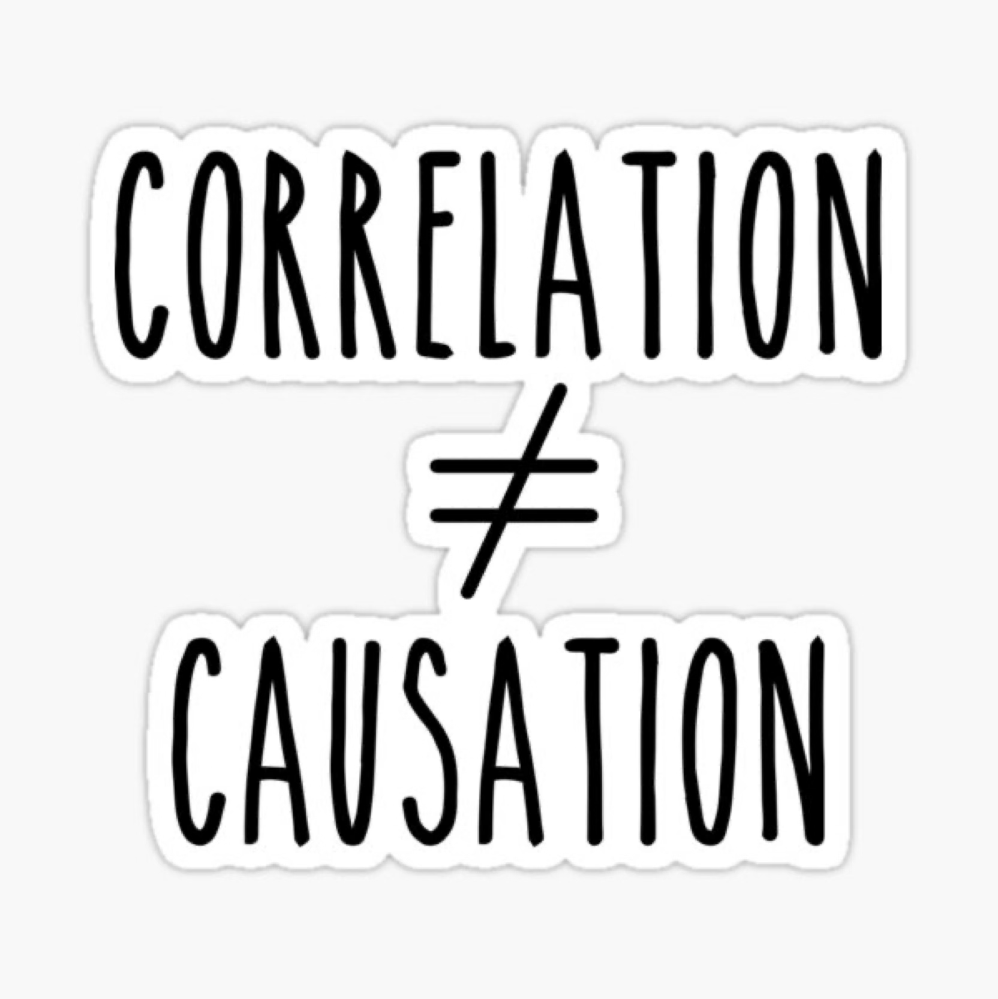

```{r}
#| include: false
library(dplyr)
library(ggplot2)
library(tibble)
library(patchwork)
library(gt)

# Site tokens (see custom.scss / DESIGN_SYSTEM.md)
sage  <- "#5C715E"  # $accent
sage2 <- "#8FAF9E"  # $accent2
sage3 <- "#A7C7B5"  # $accent3
ink   <- "#2F3E46"  # $body-color
hot   <- "#B5483B"  # "look here" highlight

theme_deck <- function(base_size = 22) {
  theme_minimal(base_size = base_size) +
    theme(
      panel.grid.minor = element_blank(),
      axis.title = element_text(color = ink),
      axis.text = element_text(color = ink),
      plot.title = element_text(color = ink, face = "bold")
    )
}

f2 <- function(x) formatC(x, format = "f", digits = 2)
f3 <- function(x) formatC(x, format = "f", digits = 3)
fp <- function(p) ifelse(p < .001, "< .001", paste("=", sub("^0", "", sprintf("%.3f", p))))
fr <- function(r) sub("^(-?)0\\.", "\\1.", sprintf("%.2f", r))   # APA style: no leading zero

# Two variables with EXACTLY the correlation r
sim_cor <- function(n, r, seed) {
  set.seed(seed)
  x <- scale(rnorm(n))[, 1]
  e <- scale(resid(lm(rnorm(n) ~ x)))[, 1]
  tibble(X = x, Y = r * x + sqrt(1 - r^2) * e)
}
cor_plot <- function(d, title, labels = FALSE) {
  p <- ggplot(d, aes(X, Y)) +
    geom_point(color = sage, size = 2.4, alpha = .8) +
    geom_smooth(method = "lm", se = FALSE, color = hot, linewidth = 1.2) +
    labs(title = title) +
    theme_deck(20)
  if (!labels) p <- p + theme(axis.text = element_blank(), axis.title = element_blank())
  p
}

# ---- Worked example: coffee and happiness (6 professors) -------------
ex <- tibble(Professor = 1:6,
             Cups = c(1, 2, 2, 3, 4, 6),
             Happiness = c(4, 5, 6, 6, 8, 9))
ex <- ex |>
  mutate(dx = Cups - mean(Cups), dy = Happiness - mean(Happiness), prod = dx * dy)
n_ex   <- nrow(ex)
cov_ex <- sum(ex$prod) / (n_ex - 1)
sx     <- sd(ex$Cups); sy <- sd(ex$Happiness)
r_ex   <- cov_ex / (sx * sy)

# ---- Significance example (n = 50) -----------------------------------
n_sig <- 50
r_sig <- .35
t_sig <- r_sig * sqrt(n_sig - 2) / sqrt(1 - r_sig^2)
p_sig <- 2 * pt(-abs(t_sig), n_sig - 2)

# ---- Study time and exam scores (n = 50, r = .85) --------------------
ex1 <- sim_cor(50, .85, 11)
```

## Correlation

### What do you know about correlations?

::::: columns
::: {.column width="55%"}
-   Correlation ≠ Causation

-   $r$

-   **Positive correlation:** variables move together

    -   As one goes up, the other goes up.

    -   As one goes down, the other goes down.
:::

::: {.column width="45%"}
{width="400"}
:::
:::::

## Correlation

### Assesses how two variables move in relation to one another

```{r}
#| echo: false
#| fig-width: 12
#| fig-height: 4.2
p1 <- cor_plot(sim_cor(100, .7, 1), "Positive correlation")
p2 <- cor_plot(sim_cor(100, -.7, 2), "Negative correlation")
p3 <- cor_plot(sim_cor(100, 0, 3), "No correlation")
p1 + p2 + p3
```

# Ok, but how?!

## Measures of Dispersion

::: callout-tip
## What are measures of dispersion?

How spread out the data are: how much participants differ.
:::

-   How did we measure dispersion when we were looking at **one** variable?

    -   **Standard deviation** and **variance**.

## Measures of Dispersion

### How many variables?

:::::: badge-row
::: content-badge
[looks_one]{.material-icons}

#### Univariate

**Uni** = one variable
:::

::: content-badge
[looks_two]{.material-icons}

#### Bivariate

**Bi** = two variables
:::

::: content-badge
[looks_3]{.material-icons}

#### Multivariate

**Multi** = more than two variables
:::
::::::

## Measures of Dispersion

::::: columns
::: {.column width="50%"}
::: callout-tip
## Univariate

**Standard deviation:** how different are participants from the average?

*Height:* $M = 5'6"$, $s = 2$ inches
:::
:::

::: {.column width="50%"}
::: callout-important
## Bivariate

**Covariance:** do the variables vary in the same way?

*Does the spread-out-ness of height overlap with the spread-out-ness of weight?*
:::
:::
:::::

## Covariance

> Professor Brocker wants to know if how many cups of coffee a professor drinks daily impacts their happiness. He asks `50` professors how many cups they have in a typical day and then has them rate their happiness on a scale of `1 to 10`.

-   Variable 1: number of cups of coffee (continuous)

-   Variable 2: happiness (continuous)

## Covariance

### Two things we could find

-   The **variance of each variable** on its own.

-   The **covariance of the two variables** together.

::::: columns
::: {.column width="50%"}
Covariance refers to how two continuous variables vary **in tandem**.

-   Generally, if cups of coffee goes up, what does happiness tend to do?

-   Generally, if happiness goes up, what does cups of coffee tend to do?
:::

::: {.column width="50%"}
{width="520"}
:::
:::::

## Covariance

### The formula

::: callout-tip
## Covariance

$COV_{XY} = \dfrac{\Sigma(X-\bar{X})(Y-\bar{Y})}{N-1}$
:::

::: callout-important
## Well, well, well... we meet again

$s^2 = \dfrac{\Sigma(X-\bar{X})^2}{N-1} = \dfrac{\Sigma(X-\bar{X})(X-\bar{X})}{N-1}$
:::

-   The variance of a variable is the covariance of that variable **with itself**.

## Covariance

### Let's break it down

::: callout-tip
## Steps

1.  Find the mean of each variable: $\bar{X} = \dfrac{\Sigma X}{n}$ and $\bar{Y} = \dfrac{\Sigma Y}{n}$.
2.  Subtract the mean of $X$ from each $X$ value, and the mean of $Y$ from each $Y$ value: $(X-\bar{X})$ and $(Y-\bar{Y})$.
3.  **Multiply** the deviation scores of $X$ with the deviation scores of $Y$: $(X-\bar{X})(Y-\bar{Y})$.
4.  **Sum** the products: $\Sigma(X-\bar{X})(Y-\bar{Y})$.
5.  Divide by $N-1$: $\dfrac{\Sigma(X-\bar{X})(Y-\bar{Y})}{N-1}$.
:::

## Covariance

### A worked example

```{r}
#| echo: false
ex |>
  rename(`X (cups)` = Cups, `Y (happiness)` = Happiness,
         `X - mean(X)` = dx, `Y - mean(Y)` = dy, `Product` = prod) |>
  gt() |>
  fmt_number(columns = c(`X - mean(X)`, `Y - mean(Y)`, Product), decimals = 2) |>
  grand_summary_rows(columns = Product, fns = list(Sum = ~ sum(.)), fmt = ~ fmt_number(., decimals = 2)) |>
  opt_row_striping() |>
  tab_options(table.font.size = 24, table.width = pct(80))
```

-   $\bar{X} = `r f2(mean(ex$Cups))`$, $\bar{Y} = `r f2(mean(ex$Happiness))`$, so $COV_{XY} = \dfrac{`r f2(sum(ex$prod))`}{`r n_ex` - 1} = `r f2(cov_ex)`$.

## Covariance

### In R

::: {.codewindow .r .codewindow-dark}
covariance.R

```{r}
#| echo: true
#| code-fold: false
cov(ex$Cups, ex$Happiness)   # covariance

var(ex$Cups)                 # the variance is a covariance with itself
cov(ex$Cups, ex$Cups)        # same number
```
:::

## Covariance

### What does it tell us?

Covariance is the **bivariate** equivalent of **variance**.

-   The sign tells us the direction: positive means the variables tend to rise together.

-   But the size is hard to interpret. It is in odd units (**cups × happiness points**) and changes if we change the scale.

-   Variance had the same problem (squared units), so we took the square root to get the standard deviation. For covariance, we **standardize** it.

## Correlation

### Standardized covariance

::: callout-tip
## Pearson correlation

$r = \dfrac{cov_{xy}}{(SD_x)(SD_y)} = \dfrac{\Sigma(X-\bar{X})(Y-\bar{Y})}{(SD_x)(SD_y)(N-1)}$
:::

-   Correlation is the **standardized covariance**: we divide the covariance by the standard deviation of $x$ times the standard deviation of $y$.

-   Just as a z-score puts a score on a unit-free scale, $r$ puts the relationship on a unit-free scale.

## Correlation

### Back to the worked example

::: callout-tip
## Compute r

$r = \dfrac{cov_{xy}}{(SD_x)(SD_y)} = \dfrac{`r f2(cov_ex)`}{(`r f2(sx)`)(`r f2(sy)`)} = `r f2(r_ex)`$
:::

::: {.codewindow .r .codewindow-dark}
correlation.R

```{r}
#| echo: true
#| code-fold: false
cor(ex$Cups, ex$Happiness)
```
:::

-   A strong positive correlation: professors who drink more coffee tend to report higher happiness.

## Correlation

### Bounded between -1 and +1

```{r}
#| echo: false
#| fig-width: 12
#| fig-height: 3.6
(cor_plot(sim_cor(100, -.9, 4), "r = -.90") +
   cor_plot(sim_cor(100, 0, 3), "r = 0") +
   cor_plot(sim_cor(100, .9, 5), "r = +.90"))
```

-   Closer to **-1** is a negative correlation, closer to **+1** is a positive correlation, and closer to **0** means no correlation.

## Correlation

### The Pearson Product-Moment Correlation (Pearson, 1895)

-   The **sign** indicates the **direction**.

-   The **number** indicates the **magnitude** (strength) of the relationship:

::: callout-tip
## Rules of thumb

-   0.1 is a small correlation

-   0.3 is a moderate correlation

-   0.5 or higher is a large correlation
:::

## Correlation and $R^2$

-   Correlation is written $r$.

-   If we square $r$, we get $R^2$, which is always positive.

-   $R^2$ is the proportion of variance the two variables **share**:

    -   the amount of $y$ accounted for by $x$,

    -   and the amount of $x$ accounted for by $y$.

## Correlation and $R^2$

### Example

> Students' grades in MTH 110 and their grades in this course correlate at $r = 0.3$.

-   A moderate correlation.

-   How much of your grade in this course is accounted for by your MTH 110 grade?

::: callout-tip
## Compute $R^2$

$R^2 = r^2 = 0.3 \times 0.3 = 0.09$, so **9%** of the variance in your grade is accounted for by your MTH 110 grade.
:::

## Is the Correlation Significant?

### Testing $H_0: \rho = 0$

-   Our sample $r$ estimates the population correlation $\rho$. Is it different from 0?

::: callout-tip
## The test

$t = \dfrac{r\sqrt{n-2}}{\sqrt{1-r^2}} \qquad df = n - 2$
:::

-   Example: $r = `r f2(r_sig)`$ with $n = `r n_sig`$ gives $t(`r n_sig - 2`) = `r f2(t_sig)`$, $p$ `r fp(p_sig)`: a significant (moderate) positive correlation.

## Is the Correlation Significant?

### In R

::: {.codewindow .r .codewindow-dark}
cor_test.R

```{r}
#| echo: true
#| code-fold: false
# cor.test() gives r, t, df, p, and a 95% confidence interval
cor.test(ex1$X, ex1$Y)
```
:::

## Pitfalls

### What can go wrong with $r$?

```{r}
#| echo: false
#| fig-width: 12
#| fig-height: 4.2
base <- sim_cor(30, .0, 21)
out  <- bind_rows(base, tibble(X = 4, Y = 4))
curve <- tibble(X = seq(-2, 2, length.out = 60)) |> mutate(Y = X^2 + rnorm(60, 0, .2))
a <- cor_plot(out, paste0("One outlier: r = ", fr(cor(out$X, out$Y))), labels = TRUE)
b <- cor_plot(curve, paste0("Curved: r = ", fr(cor(curve$X, curve$Y))), labels = TRUE) +
  geom_smooth(method = "lm", se = FALSE, color = hot)
a + b
```

::: {.callout-important appearance="minimal"}
$r$ measures **linear** relationships only, is pulled around by **outliers**, and shrinks when the range of one variable is **restricted**. **Always plot your data.**
:::

## Interpreting Correlation

::::: columns
::: {.column width="45%"}
{width="400"}
:::

::: {.column width="55%"}
-   We don't use the words *caused* or *resulting from*.

-   When reporting $r$: *"As x goes up, y tends to go up."*

-   When reporting $R^2$: *"z% of the variance in y is accounted for by x."*

-   A third variable could explain both, and the direction could run either way.
:::
:::::

## Reporting Correlation

### Correlation matrix

-   In the Method, we report descriptive statistics about our variables ($M$, $s$).

-   It is common to refer readers to a table where they can look at correlations between the variables.

-   Why might this be important?

## Correlation Matrix

Table 1 in a paper is typically a combination of descriptive stats **and** a correlation matrix:

```{r}
#| echo: false
tibble(
  Variable = c("1. Age", "2. Song 1", "3. Song 2"),
  M = c(20.91, 4.21, 6.42),
  s = c(1.76, 1.20, 2.18),
  `1` = c("--", "", ""),
  `2` = c("-.03", "--", ""),
  `3` = c(".65**", "-.34*", "--")
) |>
  gt() |>
  fmt_number(columns = c(M, s), decimals = 2) |>
  cols_align(align = "center", columns = -Variable) |>
  tab_footnote("* p < .05. ** p < .01.") |>
  opt_row_striping() |>
  tab_options(table.font.size = 28, table.width = pct(75))
```

## Reporting Correlation

### Example 1

> Researchers collected the hours spent studying and the final exam score for `50` students (scatterplot below).

```{r}
#| echo: false
#| fig-width: 8
#| fig-height: 2.6
ggplot(ex1, aes(X, Y)) +
  geom_point(color = sage, size = 2.6, alpha = .8) +
  labs(x = "Hours studying", y = "Exam score") +
  theme_deck(20) +
  theme(axis.text = element_blank())
```

-   Describe the strength and direction of the relationship. Is the correlation weak, moderate, or strong? Positive or negative?

## Reporting Correlation

### Example 1: the correlation

-   Suppose the computed Pearson correlation coefficient is $r = 0.85$. Explain what this value indicates about the relationship between the two variables.

::: {.fragment}
::: {.callout-important .nonincremental}
## Answer

A **strong, positive** linear relationship: students who studied more hours tended to earn higher exam scores. In APA style: hours studying and exam scores were strongly positively correlated, *r*(`r n_sig - 2`) = `r fr(cor(ex1$X, ex1$Y))`, *p* `r fp(cor.test(ex1$X, ex1$Y)$p.value)`.
:::
:::

## Reporting Correlation

### Example 2

> Using the same data, the researchers fit a linear regression model to predict exam scores from the number of hours spent studying. The $R^2$ value for the model is `0.72`.

::: {.callout-tip .nonincremental}
## Your questions

1.  What does $R^2 = 0.72$ tell you? What percentage of the variance is explained, and what percentage remains unexplained?
2.  Would you consider study time a good predictor of exam performance? Why or why not?
:::

## Reporting Correlation

### Example 2: answers

::: {.callout-important .nonincremental}
## Answers

1.  **72%** of the variance in exam scores is explained by study time, and **28%** remains unexplained. ($R^2 = r^2 = .85^2 \approx .72$)
2.  Study time is a **strong predictor**. Still, other factors matter, and a strong correlation does not by itself show that studying *causes* the higher scores.
:::

## Summary: Covariance & Correlation

-   **Covariance** is how two variables vary together: the bivariate equivalent of variance.

-   **Correlation** ($r$) is the **standardized covariance**: unit-free, bounded between -1 and +1.

-   The sign gives the direction and the size gives the strength; $r^2$ is the shared variance.

-   Test $H_0: \rho = 0$ with $t = r\sqrt{n-2}/\sqrt{1-r^2}$, $df = n - 2$.

-   Plot your data: outliers, curves and restricted ranges can fool $r$.

-   Correlation does **not** imply causation.
