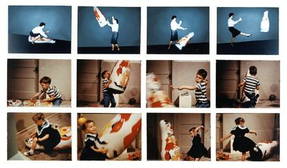

[Jump to Part 2: Measures of Central Tendency →](#part2-central-tendency){.you-callout}

## Studying Psychology

### What do researchers in the areas of psychology that are interesting to you study?

::::: columns
::: {.column width="45%"}
- **Attitudes** -- political opinions, brand preferences

- **Behaviors** -- helping strangers, procrastination

- **Brain Activity** -- fMRI response to a feared stimulus
:::

::: {.column width="45%"}
- **Memory** -- eyewitness recall accuracy

- **Attention** -- distracted driving
:::
:::::

## Studying Psychology

### The Bobo Doll Experiment (Bandura, 1961)

### 

## Studying Psychology

### Defining Variables

::: hero-def
[Operationalization]{.term-pill}
: The process of defining the measurement of a phenomenon that is not directly measurable (AKA a latent variable) though its existence is implied by other phenomena.

::: hero-example
::: panel-tabset
### Self-Report

"How disgusted do you feel right now?" -- rated on a 1-7 scale.

### Physiological

Skin conductance or facial EMG (levator labii) response while viewing a disgusting image.

### Behavioral

Willingness to touch a "contaminated" object, or how far participants move their chair away from it.
:::
:::
:::

# How could we measure happiness? {style="text-align: center;"}

[mood]{.material-icons style="font-size: 4em;"}

## Operationalization

### Figuring out how to measure something you can't directly measure.

- Attitudes

- Beliefs

- Thoughts

- Behaviors

- Brain activity

- Performance/Abilities

# What if I wanted to measure disgust? {style="text-align: center;"}



## Operationalization

### Types of Measurements

- Self-Report or Behavioral Measures

- Observation

- Implicit Measures

- Tests

## Types of Measurements

### Self-Report

- Surveys

- Questionnaires

- Polls

- Quizzes

- Instruments

## Self-Report:

### Advantages

- Most popular method of assessing attitudes

- Can obtain large amounts of data

  - (Fairly) Quick

- Allows for adaptive testing

  - (Fairly) Inexpensive

## Self-Report:

### Disadvantages

- Acquiescence

  - Tendency to say yes, true, agree

- Social desirability

  - Tendency to respond in ways that are seen as socially acceptable

- Demand characteristics

  - Tendency to response in ways that participant thinks researcher wants

## Self-Report:

### Avoiding Disadvantages

<details>
<summary>Anonymous respondents are less likely to make things up</summary>

Assure anonymity

</details>

<details>
<summary>Allow respondents to answer in private</summary>

Allow for maximum privacy

</details>

<details>
<summary>Don't make your experiment too obvious/revealing</summary>

Obscure the true goal of the experiment

</details>

<details>
<summary>Add questions that test for respondent awareness</summary>

Include attention checks

</details>

<details>
<summary>Purposely make some questions opposite</summary>

Reverse coding

</details>

## Behavioral Measures

### Examples

- Taking a flier

- Signing a petition

- Internet Behavior

- Moving a chair

- Donating money

::: icon-row
::: icon-row-item
<i class="bi bi-file-earmark-text"></i>

Petitions & Fliers
:::

::: icon-row-item
<i class="bi bi-arrows-move"></i>

Moving a Chair
:::

::: icon-row-item
<i class="bi bi-cash-coin"></i>

Donating Money
:::
:::

## Observation

### The Bobo Doll Experiment (Bandura, 1961)

### 

## The Bobo Doll Experiment

### (Bandura, 1961)

- Live aggression by adult

- Videotaped aggression by adult

- Cartoon aggression

  - No aggression

## Observation

### Disadvantages

- Time consuming

- Different reviewers/observers may score behaviors differently.

  - Coding scheme

    - *Who* decides what is an example of the behavior?

  - Inter-rater Reliability

    - How much *agreement* is there between 2+ observers?

## Implicit measures

### Brain activity

::::: columns
::: {.column width="50%"}
- Functional Magnetic Resonance Imaging (fMRI)

  - Neuroimaging of brain activity
:::

::: {.column width="50%"}
- Electroencephalography (EEG)

  - Electrodes on surface of scalp measures brain activity
:::
:::::

## Issues with Operationalization

### Why is it hard to measure psychological phenomena?

- Others may choose to measure the phenomena differently from us

- Operationalization can be culture-specific

- What we measure is based on observable parts of the phenomena, but some parts may not be able to be observed

  - Measuring only the observable is imprecise

# How else could Bandura have measured aggression? {style="text-align: center;"}

<i class="fa-solid fa-face-angry fa-5x fa-bounce"></i>

## Operationalization

### How should we measure aggression in children?

- Observe children for one hour and...

  - **Label** them as Aggressive or Non-Aggressive

  - **Rank** them from most aggressive to least aggressive

  - **Score** them on a 10-point scale.

    - 1 = No Aggression

    - 10 = All of the Aggression

  - **Count** number of aggressive behaviors

## Scales of Measurement

### A Scale By Any Other Name

- ~~**Labels**~~ Nominal

- ~~**Rank**~~ Order

- ~~**Scale**~~ Interval

- ~~**Count**~~ Ratio

## Nominal (Categories, No Order)

- Type of therapy (CBT, psychoanalysis, EMDR)
- Diagnosis (Major Depressive Disorder, Generalized Anxiety Disorder, none)
- Relationship status (single, dating, married, divorced)
- Coffee drinker vs. non-coffee drinker

# Raise your hand if you’re a coffee drinker, tea drinker, or energy-drink person. {style="text-align: center;"}



## Ordinal (Ranked, Uneven Gaps)

### Examples:

- Rank order of stress: mild / moderate / severe
- Olympic medals (gold, silver, bronze)
- Likert-style agreement (Strongly Disagree → Strongly Agree) — though technically often treated as interval in practice
- Clinical severity ratings (minimal, mild, moderate, severe depression)

# Who’s seen the movie *Inside Out*? Imagine ranking the emotions in order of how often you feel them—Fear first, then Joy, then Anger. {style="text-align: center;"}



## Interval (equal distances, no true zero)

### Examples:

- IQ scores

- Standardized test scores (e.g., SAT, GRE)

- Temperature in Fahrenheit or Celsius

- GPA

# If someone has a GPA of 0.0, does that mean they don’t exist as a student? No—it just means they failed. {style="text-align: center;"}



## Ratio (equal distances, true zero)

### Examples:

- Reaction time (can be 0 ms)

- Number of therapy sessions attended

- Cortisol level in blood

- Hours of sleep last night

- Money donated to a cause

# How many hours of sleep did you get last night? If you got 0, that really means 0. {style="text-align: center;"}



## Interval vs Ratio

### What's the difference between interval and ratio?

- Interval may have a 0 on the scale, but it doesn't mean the absence of something. A 0.0 GPA means an F rather than the absence of a grade.

- Ratio has a 0 that. means 0 (the absence of something), like a '0' as a response to the questions, "How many drinks did you have last night?"

## Discrete and Continuous

### What's the Difference?

```{=html}
<iframe class = slide-deck src="https://farmingdale.qualtrics.com/jfe/form/SV_8BmvWRKoN0pX36e" width="100%" height="50%"></iframe>
```

## Discrete and Continuous

### Discrete variables have predefined values

- **Number of siblings** (you can’t have 2.5 siblings)

- **Number of errors on a test**

- **Types of therapy** (CBT, psychoanalysis, none)

- **Diagnostic category** (depression, anxiety, bipolar, etc.)

- **Eye color**

- **Number of cups of coffee consumed today**

## Discrete and Continuous

### Continuous Variables can occupy several different values

- **Reaction time** (seconds, milliseconds)

- **Height** (inches, centimeters)

- **Weight** (pounds, kilograms)

- **Self-esteem score** on a 1–10 scale

- **GPA**

- **Hours of sleep last night** (can be 7.25 hours)

- **Brain activity** (EEG voltage, fMRI signal intensity)

## Determining Scale of Measurement

### Identify the scale of measurement.

> Undergraduates report their self-esteem on a scale of 1 to 10. Researchers assess the relationship of undergraduates’ self-esteem and GPA.

<details>
<summary>Reveal Answer</summary>

::: nonincremental
- Predictor variable: **Self-Esteem** \| [Continuous (Interval)]{.bg style="--col: #e64173"}
- Outcome variable: **GPA** \| [Continuous (Interval)]{.bg style="--col: #e64173"}
:::

</details>

## Determining Scale of Measurement

### Identify the scale of measurement.

> Participants are given a mystery drug or placebo and then asked to complete puzzle tasks. Researchers time how long participants take to complete the puzzles.

<details>
<summary>Reveal Answer</summary>

::: nonincremental
- Independent variable: Drug vs. Placebo \| [Categorical (Nominal)]{.bg style="--col: #e64173"}
- Dependent variable: Reaction Time \| [Continuous (Ratio)]{.bg style="--col: #e64173"}
:::

</details>

## Determining Scale of Measurement

### Identify the scale of measurement.

> Undergraduates are shown either pictures of death or pictures of landscapes. They then report their anxiety about aging on a scale of 1 (none) to 10 (lots).

<details>
<summary>Reveal Answer</summary>

::: nonincremental
- Independent variable: Pictures of death versus landscapes \| [Categorical (Nominal)]{.bg style="--col: #e64173"}
- Dependent variable: Anxiety about dying \| [Continuous (Interval)]{.bg style="--col: #e64173"}
:::

</details>

## Why Does Scale of Measurement Matter?

### For Science!

- Statistical tests can only be run on specific scales of measurement.

- t-test & ANOVA: Nominal IV/predictor and Continuous DV/outcome

- Correlation & Regression: All continuous

## Why Does Scale of Measurement Matter?

- Generally, continuous variables (interval and ratio scales) lend themselves better to statistical analysis.

- As a researcher, you should plan out your statistical analysis BEFORE conducting your study, so that you measure your variables in a way that matches the type of analyses you will run.

## Takeaway: *How* we measure variables matters...

### because it dictates what kind of statistical analyses we can run.

- Data can be coerced into different formats

- 'Correct' or 'Supporting' results can come from bogus data

- We’ve measured aggression/self-esteem/attention. Now, how do we summarize all these numbers?

## Statistical Terms & Symbols

{fig-align="center" width="632" style="border-radius: 20px;"}

## Statistical Symbols

### Case-sensitive and often Greek

- $n$ = the number of people in the sample

- $x$ = one datapoint in a sample

- $\bar{x}$ = Arithmetic mean (average) for a sample, x

- $\Sigma(x)$ = The sum of all values in a sample, x

- $\sum^{n}_{i = 1}= x_1 +x_2+x_3...$

## Practice 1

### Study Up!

> Esmeralda is taking Statistics for the Psychological Sciences. On her first exam, she scored 98. The average grade among the 26 students on that exam was 97

- n:

- x:

- $\bar{x}$:

<details>
<summary>Reveal Answers</summary>

::: nonincremental
- n: 26
- x: 98
- $\bar{x}$: 97
:::

</details>

## Practice 2

### Have you ever heard of this show?

> Dave is interested in how many FSC students watch the Netflix Original, Dark. He plans to ask 200 students if they have seen it or not.

N:

n:

Scale of Measurement:

## Practice 3

### Be Kind to Yourself!

::::: columns
::: {.column width="55%"}
> A research study surveys 500 college student across 5 campuses in the United States, asking them to rate their self-esteem on a scale of 1 to 10.

Sample:

Population:

Scale of Measurement:
:::

::: {.column width="45%"}
<details>
<summary>Reveal Answers</summary>

::: nonincremental
- Sample: the 500 college students surveyed across the 5 campuses
- Population: college students in the United States more broadly (what the sample is meant to represent)
- Scale of Measurement: Ordinal -- technically ordinal (Likert-style), though often treated as interval in practice. Ask the class why researchers commonly treat scales like this as interval anyway.
:::

</details>
:::
:::::

## Measures of Central Tendency {#part2-central-tendency}

### Part 2: What's in the Middle?

## **Review**

### Scales of Measurement

::: {.incremental .highlight-last}
- What are the 4 scales of measurement

- What are the only scales of measurement that matter for us?
:::

## Review

### Scales of Measurement

::: {.incremental .highlight-last}
- Nominal

  - Categories, No Equal Gaps

- Ordinal

  - Ordered, No Equal Gaps

- Interval

  - Quantitative, Equal Gaps, No True 0

- Ratio

  - Quantitative, Equal Gaps, True 0
:::

## Review

### Statistical Terms

::: {.incremental .highlight-last}
- n = ?

- x = ?

- $\bar{x}$ = ?
:::

## **Review**

### Statistical Terms

- n = the number of people in the sample

- x = one participant's score

- $\bar{x}$ = sample mean (pronounced x-bar)

## **Review**

### Statistical Terms

::: term-list
::: fragment
[Parameter]{.term-pill}
: Information that describes the population.
:::

::: fragment
[Statistic]{.term-pill}
: Information that describes the sample -- used to make inferences about the population.
:::
:::

## **Descriptive Statistics**

### Describe the characteristics of the sample.

- Think about our data on time spent on Instagram/phones in general.

- How could we *describe* it?

  - Average

    - Overall, what is the typical duration

  - Min & Max

    - Highest and Lowest

  - Most Frequent/Most Infrequent

    - What are the most common durations?

    - Least common?

## **Descriptive Statistics**

### Describe the characteristics of a sample in terms of:

::: term-list
::: fragment
[Central Tendency]{.term-pill}
: What most people said -- summarized via the mean, median, and mode.
:::

::: fragment
[Dispersion]{.term-pill}
: How spread out the data are -- summarized via the standard deviation.
:::
:::

## **Measures of Central Tendency**

### What Do They Tell Us?

- Where the "center" of a distribution sits

- What a typical/most common participant answer looks like

## The average GPA in the class is 3.2

### What does that actually mean?

::: you-callout
Turn to a neighbor: what does that single number NOT tell you about the class?
:::

<details>
<summary>Discussion Points</summary>

::: nonincremental
- It can't tell you whether everyone scored close to 3.2, or half the class is at 4.0 and half is at 2.4
- It doesn't reveal outliers -- a few 1.0s or a few 4.0s can shift it
- Two classes with wildly different distributions of grades could still land on the exact same average
:::

</details>

## Quick LaTeX Primer

### Reading the Notation (So You Don't Have To Guess)

::: callout-tip
- $x$ -- a single value in your data

- $\bar{x}$ -- "x-bar," the **mean**

- $n$ -- the number of values (sample size)

- $\sum$ -- "sigma," meaning **add these up**

- $\sum_{i=1}^{n} x_i$ -- the formal way of writing "add up every value, 1st through nth" -- means the same thing as just writing $x_1 + x_2 + x_3 ...$

- $\frac{a}{b}$ -- a fraction: $a$ divided by $b$
:::

## **Measures of Central Tendency**

### Mean \| Average

::: callout-important
::: fragment
The average; obtained by summing all values and dividing by the number of values.
:::

::: fragment
$\Large{\bar{x} = \dfrac{\sum(x)}{n}}$
:::

::: fragment
$\Large{[3,4,5,2,1] \rightarrow \dfrac{\color{red}{3+4+5+2+1}}{\color{blue}{5}} = \dfrac{15}{5} = \bar{x} = 3}$
:::
:::

- Think about how you calculate your GPA or grade for a class

- When would you use this in research?

## **Measures of Central Tendency**

### Median

::: callout-important
- The middle number; obtained by ordering all values from lowest to highest and taking the middle (if n is odd or the average of the 2 middle if n is even)

- $\large{x = \{4,2,5,6,3\}}$

- $\large{x = \{2,3,4,5,6\}}$

- $\large{x = \{2,3,\color{blue}{4},5,6\}}$
:::

<details>

<summary>Why does income get reported as a median instead of a mean?</summary>

Income distributions are heavily right-skewed by a small number of very high earners, which pulls the mean upward. The median isn't affected by those extreme values, so it better represents what a "typical" person actually earns.

For example, O\*NET reports the 2025 median annual wage for Psychologists as **$110,840** ([O\*NET OnLine, 19-3039.00](https://www.onetonline.org/link/summary/19-3039.00)) -- a handful of very high (or very low) earners in the field wouldn't shift that median the way they'd shift a mean.

</details>

<details>

<summary>When would you want this for research?</summary>

Any time your variable is skewed or outlier-prone -- reaction times, wait times, salaries, hospital stays -- the median gives a more honest sense of the "typical" case than the mean does.

</details>

## **Measures of Central Tendency**

### Mode

::: callout-important
- The most frequent answer; obtained by counting how many times each answer is given and taking the value that occurs most often

- $x = [1,1,2,2,\color{green}{3},\color{green}{3},\color{green}{3},4,5,7,8]$
:::

- What's your favorite genre of music?

- When would you want this for research?

## **Measures of Central Tendency**

### Standard Normal Distribution

::::: columns
::: {.column width="50%"}
```{r}
#| fig-width: 8
#| fig-height: 6
#| fig-align: center


library(ggplot2)

x <- seq(5, 15, length = 1000)

y <- dnorm(x, mean = 10, sd = 1)

nm <- data.frame(x, y)

ggplot(data = nm, aes(x, y)) +
  geom_area(fill = "#DCE8E1", alpha = 0.8) +
  geom_line(color = "#5C715E", linewidth = 1.2) +
  geom_vline(xintercept = 10, color = "#2F3E46", linewidth = 0.8, linetype = "dashed") +
  annotate("label", x = 10, y = 0.42, label = "Mean = Median = Mode",
           fill = "#5C715E", color = "white", fontface = "bold", size = 5, label.size = 0) +
  labs(x = "", y = "") +
  theme_minimal(base_size = 16) +
  theme(
    axis.text = element_blank(),
    panel.grid = element_blank()
  )
```
:::

::: {.column width="50%"}
In a normal distribution, the mean, median, and mode are equal to one another.

Mean = Median = Mode
:::
:::::

## **Measures of Central Tendency**

### Mean

::::: columns
::: {.column width="50%"}
```{r}
data.frame(
  z = rnorm(500, 30, sd = 10)
) |>
  ggplot(aes(z)) +
  geom_histogram(aes(y = after_stat(density)), binwidth = 5,
                 fill = "#A7C7B5", color = "white") +
  geom_density(color = "#5C715E", linewidth = 1.2) +
  labs(x = "Value", y = "Density") +
  theme_minimal(base_size = 14)
```
:::

::: {.column width="50%"}
- The mean is only helpful in a [**normal distribution**]{.underline} -- also called a normal curve or bell curve.

- We overwhelmingly use the mean, because in the social and behavioral sciences, we nearly always assume the distribution is normal.

- A histogram (counts, in bins) and a density plot (a smoothed curve) show the same underlying shape -- a density plot is just what this histogram would look like with infinitely thin bins.
:::
:::::

## Why Do We Assume Normality?

::::: columns
::: {.column width="50%"}
```{r}
set.seed(123)

# Population: strongly skewed (exponential distribution)
pop <- rexp(100000, rate = 1)

# Take many samples of size 30 and compute their means
sample_means_30 <- replicate(5000, mean(sample(pop, 30, replace = TRUE)))

# Take many samples of size 100 and compute their means
sample_means_100 <- replicate(5000, mean(sample(pop, 100, replace = TRUE)))

# Plot population vs. sampling distributions
df <- data.frame(
  value = c(pop, sample_means_30, sample_means_100),
  group = rep(c("Population (Skewed)", 
                "Sampling Dist (n = 30)", 
                "Sampling Dist (n = 100)"), 
              times = c(length(pop), length(sample_means_30), length(sample_means_100)))
)

ggplot(df, aes(x = value, fill = group)) +
  geom_histogram(bins = 50, alpha = 0.6, position = "identity") +
  facet_wrap(~group, scales = "free_y") +
  theme_minimal(base_size = 14) +
  labs(
    title = "Central Limit Theorem in Action",
    subtitle = "Population is skewed, but sampling distributions of the mean approach normality",
    x = "Value", y = "Frequency"
  )
```
:::

::: {.column width="50%"}
- We assume normality because the math works better

- The **Central Limit Theorem** makes it reasonable

- Many human traits actually do cluster in bell-shaped patterns.
:::
:::::

## Central Limit Theorem

### [The Galton Board](https://www.mathsisfun.com/data/quincunx.html)


[More Examples](https://editor.p5js.org/pazatico/sketches/n_CYcQBIF)

## **Measures of Central Tendency**

### When should we use the median...

::::: columns
::: {.column width="50%"}
- A skewed distribution occurs when one side of the data gets cut off due to measurement limitation.

- In a skewed distribution, the mean gets pulled out toward the tail, and the mode gets pulled to the cluster.

- The median is the best measure of central tendency for skewed distributions because it tells us how most people answered.
:::

::: {.column width="50%"}
```{r}
# Set seed for reproducibility
set.seed(123)

# Generate 1000 random values from a Beta distribution
left_skewed <- rbeta(1000, shape1 = 2, shape2 = 5)

data.frame(left_skewed) |> 
  ggplot(aes(left_skewed)) + 
  geom_histogram(fill = "lightcoral") +
  labs(
    title = "Left-Skewed Distribution",
    x = "",
    y = ""
  ) + 
  theme_minimal() + 
  geom_vline(xintercept = 
               median(left_skewed)) +
  geom_vline(xintercept = 
               mean(left_skewed)) 
```
:::
:::::

## **Measures of Central Tendency**

### **The Mode**

::::: columns
::: {.column width="50%"}
- The mode is good for bi-or-tri-modal distributions.

- When might you have a bi-modal distribution?
:::

::: {.column width="50%"}
```{r}
exam <- 
  data.frame(
    l = c(rnorm(500,80,1),
          rnorm(500,65,1))
  )

ggplot(exam,aes(l)) + 
  geom_histogram(fill = "darkgreen") +
  labs(
    x = "",
    y = "",
    title = "When half of the class scores high and the other half doesn't",
    subtitle = "Black and Dashed lines represent median and mean"
  ) + 
  theme_minimal() +
  geom_vline(xintercept = 65,
             color = "red") + 
  geom_vline(xintercept = 80,
             color = "red") +
  geom_vline(aes(xintercept=mean(l)),lty="dashed") +
  geom_vline(aes(xintercept=median(l)),lty="solid")+
  theme(
    plot.title = 
      element_text(
        size = 20, 
        face = "bold")
  )
```
:::
:::::

## **Measures of Central Tendency**

### **Example: Mode**

```{r}
#| fig-align: center


exam <- 
  data.frame(l = c(
    rnorm(500,1,0.5), 
    rnorm(500,5,0.5)) 
    )

ggplot(exam, aes(l)) + 
  geom_histogram(fill = "maroon") +
  labs(x = "", 
       y = "", 
       title = "When half the class loves something and the other class hates it!",
       subtitle = "On a scale of 1-7, how much do you like Professor Brocker's jokes?") + 
  theme_minimal() + 
  theme(
    plot.title = 
      element_text(
        size = 20, 
        face = "bold")
    )
```

## When should we use...

::: {.incremental .highlight-last}
- Mean

  - good for normal distributions

- Median

  - good for skewed distributions

- Mode

  - good for bi-modal distributions
:::

## Central Tendency

### Which should we use?

```{r}
#| fig-align: center

data.frame(l = c(
    rnorm(500,1,0.5), 
    rnorm(500,5,0.5)) 
    ) |> 
ggplot(aes(l)) + 
  geom_histogram(fill = "darkblue") +
  labs(x = "", 
       y = "",
       title = "Two or More Peaks") + 
  theme_minimal(base_size = 15)
```

## Central Tendency

### Which should we use?

```{r}
#| fig-align: center


# Set seed for reproducibility
set.seed(123)

# Generate 1000 random values from a Beta distribution
left_skewed <- rbeta(1000, shape1 = 2, shape2 = 5)

data.frame(left_skewed) |> 
  ggplot(aes(left_skewed)) + 
  geom_histogram(fill = "grey80") +
  labs(
    x = "",
    y = "",
    title = "Slide to the Left!",
    subtitle = "Dashed and solid lines represent mean and median"
  ) + 
  theme_minimal(base_size = 15) +
  geom_vline(aes(xintercept=mean(left_skewed)), lty="dashed") +
  geom_vline(aes(xintercept=median(left_skewed))) 
```

## Central Tendency:

### Which should we use?

```{r}
#| fig-align: center


data.frame(
  l = rnorm(500,12,1)
    ) |> 
ggplot(aes(l)) + 
  geom_histogram(fill = "darkorange") +
    geom_vline(aes(xintercept=mean(l)), lty="dashed") +
  geom_vline(aes(xintercept=median(l))) +
  labs(x = "", 
       y = "",
       title = "Looks Normal to Me",
        subtitle = "Dashed and solid lines represent mean and median"
       ) + 
  theme_minimal(base_size = 15)
```

## Calculating Measures of Central Tendency

### **Calculating The mean**

::: callout-tip
1.  Sum all x values
2.  Divide by the number of x values (n).
3.  $\large{x = 4,2,5,6}$
4.  $\large{\frac{\sum(x)}{n}}$
5.  $\large{\sum(x) = 4 + 2 + 5 + 6 = 17}$
6.  $\large{\frac{17}{4} = \color{red}{4.25}}$
:::

## Calculating Measures of Central Tendency

### **Calculating The median**

::: callout-tip
1.  Put all x values in order from smallest or largest or largest to smallest.
2.  Find the middle number.
3.  If there are an even number of x values, take the average of the 2 middle numbers.
4.  $\large{x = \{6,2,4,2,8\}}$
5.  $\large{x = \{2,2,4,6,8\}}$
6.  $\large{x = \{2,2,\color{blue}{4},6,8\}}$
:::

## Calculating Measures of Central Tendency

### **Calculating The mode**

::: callout-tip
1.  Put all x values in order from smallest or largest or largest to smallest.
2.  Find the number or numbers that repeat the most.
3.  $\large{x = [3,2,1,5,3,7,8,3,2,4,1]}$
4.  $\large{x = [1,1,2,2,\color{green}{3},\color{green}{3},\color{green}{3},4,5,7,8]}$
5.  There can be more than 1 mode.
:::

## **Using Excel**

### **Excel Practice**

::::: columns
::: {.column width="50%"}
<center>

<iframe width="800" height="600" src="https://docs.google.com/spreadsheets/d/1Dy3reM8KfCgOe2YTonTqw0zQ8cvq1rUiwkNVl3J8Tig/edit?usp=sharing&amp;rm=minimal&amp;single=true&amp;">

</iframe>

</center>
:::

::: {.column width="50%"}
- What does each row in this spreadsheet represent?

- What does each column in this spreadsheet represent?
:::
:::::

## **Excel Practice**

::::: columns
::: {.column width="50%"}
<center>

<iframe width="800" height="600" src="https://docs.google.com/spreadsheets/d/1Dy3reM8KfCgOe2YTonTqw0zQ8cvq1rUiwkNVl3J8Tig/edit?usp=sharing&amp;rm=minimal&amp;single=true&amp;">

</iframe>

</center>
:::

::: {.column width="50%"}
- Adding & Sum: `SUM(B2:B10)`

- Subtracting: `=C9 - C2`

- Multiplying: `=B12 * 4`

- Dividing: `=A2/B3`

- Squaring: `=(B2-C2)^2`

- Average: `=AVERAGE(B2:B20)`
:::
:::::

## **Excel Practice**

::::: columns
::: {.column width="50%"}
<center>

<iframe width="800" height="600" src="https://docs.google.com/spreadsheets/d/1Dy3reM8KfCgOe2YTonTqw0zQ8cvq1rUiwkNVl3J8Tig/edit?usp=sharing&amp;rm=minimal&amp;single=true&amp;">

</iframe>

</center>
:::

::: {.column width="50%"}
- Calculate the Mean

- Using `=SUM(x)/n`

- Using `=AVERAGE(x)`

- Calculate the Median

- Find the `Mode(s)`
:::
:::::

## **Review**

### When do we use the and how do we caluclate the...

- Mean?

- Median?

- Mode?

## **Key Takeaways Slide**

- **Mean** → good for symmetric/normal.

- **Median** → good for skewed/outlier-heavy.

- **Mode** → good for categorical or multi-modal

- We assume normality because it lets us use the mean.