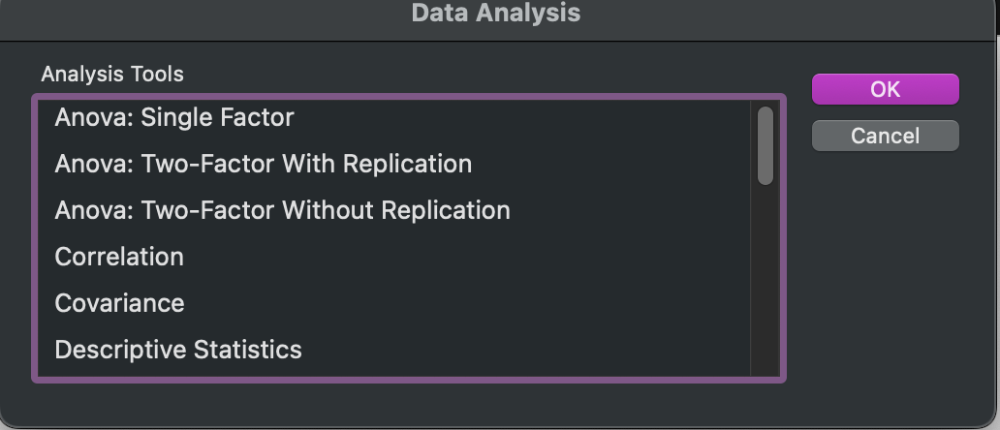
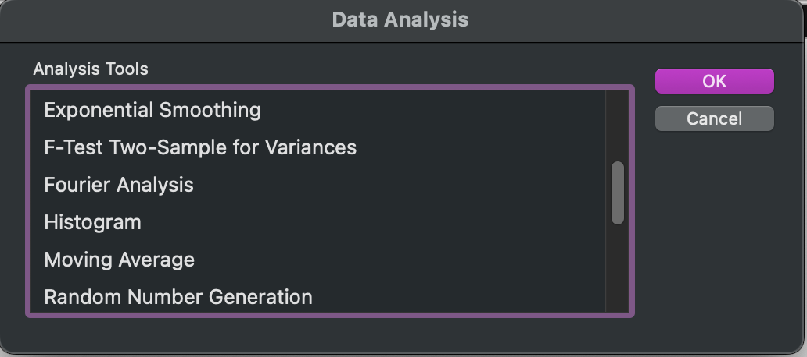
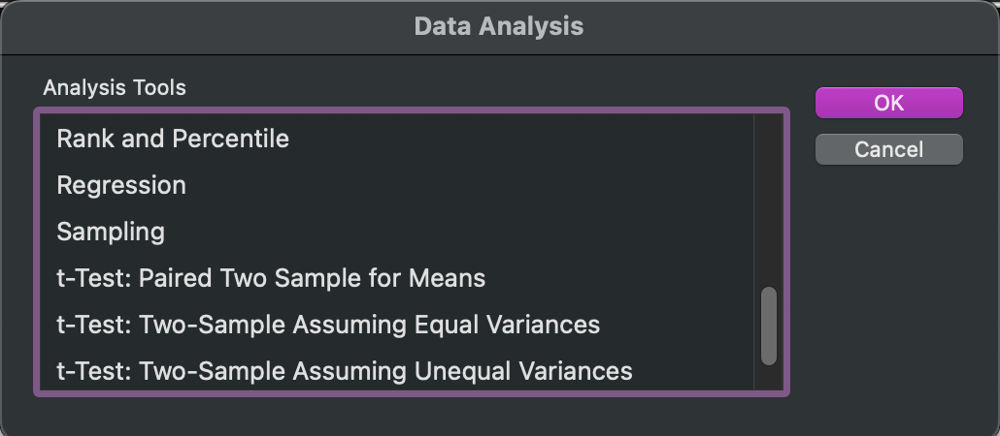

## Statistical Software

### Excel, R, SPSS, Jamovi, JASP – Oh My!

There are several tools you can use for statistical analyses.

::: highlight-last
- PSY 360 (Research Methods) typically employs the use of both Excel and SPSS

- I think the best approach is to use these options *in addition* to free software such as R.
:::

## Statistical Software

### The Menu

:::::: {.badge-row .badge-row-5}
::: content-badge
[table_chart]{.material-icons}

#### Excel

Familiar, and good for the core concepts
:::

::: content-badge
[code]{.material-icons}

#### R

Free, flexible, runs in a browser
:::

::: content-badge
[analytics]{.material-icons}

#### SPSS

Point-and-click, with a syntax editor
:::

::: content-badge
[touch_app]{.material-icons}

#### Jamovi

Free, point-and-click
:::

::: content-badge
[query_stats]{.material-icons}

#### JASP

Free, point-and-click
:::
::::::

## Statistical Software

### R

::: {.incremental .highlight-last}
- R is available on all Operating Systems completely free of charge and can even be accessed through web browsers such as Safari, Chrome, or Mozilla Firefox.

- As an added bonus, R is *even* accessible in *this* presentation!
:::

::: keycap-line
Press ~` (no Shift needed) to open R.
:::

::: {.callout-tip appearance="minimal"}
**Script** (top) is where you write code. **Console** (bottom) is where R answers.
:::

## Statistical Software

### Why should I care?

Your time is worth something and if I can show you a different way of approaching statistical questions that you might find easier—I will do whatever I can to do so!

::: {.incremental .highlight-last}
- Your future job might not have SPSS

- You can learn programming syntax and troubleshoot in real-time
:::

## Statistical Software

### Excel

We have used Microsoft Excel in this course to demonstrate core concepts such as finding the arithmetic average, standard deviation, measures of central tendency, and calculating z-scores.

::: {.incremental .highlight-last}
- Since statistical tests are mathematical at a base-level, nearly any test that can be run elsewhere can be run in Excel
:::

## Statistical Software

### Excel: Data Analysis Toolpak

Excel has first-party addons such as the `Data Analysis Toolpak` (and third-party ones too). The `Data Analysis Toolpak` can run the following tests:

::: panel-tabset
### Top

{fig-alt="Data Analysis Toolpak list, top: ANOVA, Correlation, Covariance, Descriptive Statistics" width="42%"}

### Middle

{fig-alt="Data Analysis Toolpak list, middle: Exponential Smoothing through Random Number Generation" width="42%"}

### Bottom

{fig-alt="Data Analysis Toolpak list, bottom: Rank and Percentile through t-Tests" width="42%"}
:::

::: {.callout-tip appearance="minimal"}
Whoa! Those are *a lot* of tests! Excel is an absolute powerhouse, but some of the tests and options are somewhat difficult to access and/or have a steep learning curve.
:::

## Statistical Software

### SPSS

::: hero-def
[SPSS]{.term-pill}

: **S**tatistical **P**ackage for the **S**ocial **S**ciences. Used in a variety of disciplines, with options for the majority of tests you will end up running in your academic career, plus a syntax editor that gives you more control over your data, tests, and outputs.
:::

## Statistical Software

### SPSS: Example

Let's walk through an example in SPSS step-by-step.

::: callout-tip
## Setup

1. Download the dataset `movie_dat_trimmed.csv` from Brightspace
2. Double-click on IBM SPSS, then open the file
:::

## SPSS: Example

### Descriptive Statistics

SPSS does its best to analyze your data and assign data value types (continuous, nominal) as well as scales of measurement (nominal, ordinal, interval, ratio).

::: {.incremental .highlight-last}
- SPSS will *only* allow specific data types to be analyzed in specific ways

- SPSS does not always 'know' what you are looking for, so *you* need to make sure your data is set up correctly!
:::

## SPSS: Example

### Two Views

SPSS has two views.

::::: term-list
::: fragment
[Variable View]{.term-pill}

: An overview of your variables.
:::

::: fragment
[Data View]{.term-pill}

: A glimpse of your raw data.
:::
:::::

## SPSS: Example

### Two Views: What to Look For

::::: {.columns}
::: {.column width="50%"}
::: callout-tip
## Variable View

- What is the name?
- What is the data type?
- What is the range of values?
- Are there any labels?
- What is the Measure type?
:::
:::

::: {.column width="50%"}
::: callout-tip
## Data View

- What is in the first column?
- What is in the second column?
- etc.
:::
:::
:::::

## SPSS: Example

### Descriptive Statistics

Descriptive Statistics *describe* the data, they give us an idea of where our data (likely) comes from, the measures of central tendency, and estimation about normality can be made.

::::: columns
::: {.column width="50%"}
- Mean \| Sum

- Standard Deviation

- Range

- Mode
:::

::: {.column width="50%"}
- Kurtosis\*

- Skewness\*
:::
:::::

::: {.callout-tip appearance="minimal"}
\* Kurtosis and skewness help us judge how close to normal our data is.
:::

## SPSS: Example

### Frequency Statistics

Frequency Statistics give us an idea of the composition of our dataset and allow us to make estimations and guesses in relation to the normality of our data

::: {.incremental .highlight-last}
- Frequency of Responses (% or n)

- Minimum Values

- Max Values

- Range
:::

## SPSS: Example

### Your Turn

::: callout-important
## Descriptive and Frequency Statistics

In our dataset, we want to investigate the *categorical composition* of our data as well as the *statistical makeup* of our data.

For the dataset provided, find the descriptive statistics and frequency statistics for each variable of the appropriate data type.
:::
