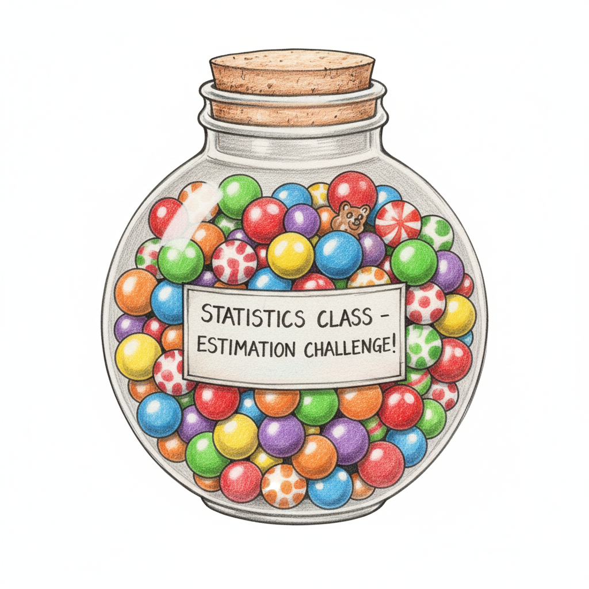

```{r}
#| include: false
library(dplyr)
library(ggplot2)
library(tibble)
library(purrr)
library(gt)

# Site tokens (see custom.scss / DESIGN_SYSTEM.md)
sage  <- "#5C715E"  # $accent
sage2 <- "#8FAF9E"  # $accent2
sage3 <- "#A7C7B5"  # $accent3
ink   <- "#2F3E46"  # $body-color
hot   <- "#B5483B"  # "look here" highlight

# The running example: ratings of "Dark" on a 1-10 scale.
mu    <- 6.6                 # population mean rating
sigma <- 1.5                 # population SD of individual ratings
n     <- 500                 # sample size per student
se    <- sigma / sqrt(n)     # standard error of the mean (~0.067)

theme_deck <- function(base_size = 22) {
  theme_minimal(base_size = base_size) +
    theme(
      panel.grid.minor = element_blank(),
      panel.grid.major.y = element_blank(),
      axis.text.y = element_blank(),
      axis.title = element_text(color = ink),
      axis.text.x = element_text(color = ink),
      plot.title = element_text(color = ink, face = "bold"),
      strip.text = element_text(color = ink, face = "bold")
    )
}

# One normal curve from the theoretical density, with optional shaded
# region (shade = c(lower, upper)) and optional red marker line(s).
norm_plot <- function(mu, sd, lo = mu - 4 * sd, hi = mu + 4 * sd,
                      shade = NULL, fill = sage2, xlab = NULL,
                      breaks = ggplot2::waiver(), mark = NULL) {
  d <- tibble(x = seq(lo, hi, length.out = 800), y = dnorm(x, mu, sd))
  p <- ggplot(d, aes(x, y))
  if (!is.null(shade)) {
    p <- p + geom_area(data = filter(d, x >= shade[1], x <= shade[2]),
                       fill = fill, alpha = .75)
  }
  p <- p +
    geom_line(color = sage, linewidth = 1.4) +
    geom_vline(xintercept = mu, linetype = "dashed", color = ink) +
    scale_x_continuous(breaks = breaks, limits = c(lo, hi)) +
    labs(x = xlab, y = NULL) +
    theme_deck()
  if (!is.null(mark)) p <- p + geom_vline(xintercept = mark, color = hot, linewidth = 1.2)
  p
}

# Standard normal curve. bands = TRUE adds the 68-95-99.7 areas.
z_plot <- function(shade = NULL, fill = hot, bands = FALSE) {
  d <- tibble(x = seq(-4, 4, length.out = 800), y = dnorm(x))
  p <- ggplot(d, aes(x, y))
  if (bands) {
    p <- p +
      geom_area(data = filter(d, abs(x) <= 1), fill = sage3, alpha = .8) +
      geom_area(data = filter(d, x >= 1, x <= 2), fill = sage2, alpha = .8) +
      geom_area(data = filter(d, x <= -1, x >= -2), fill = sage2, alpha = .8) +
      geom_area(data = filter(d, x >= 2), fill = sage, alpha = .8) +
      geom_area(data = filter(d, x <= -2), fill = sage, alpha = .8) +
      geom_text(
        data = tibble(
          x = c(-.5, .5, -1.5, 1.5, -2.5, 2.5, -3.5, 3.5),
          y = c(.2, .2, .08, .08, .025, .025, .012, .012),
          label = c("34.1%", "34.1%", "13.6%", "13.6%", "2.1%", "2.1%", "0.1%", "0.1%")
        ),
        aes(x, y, label = label), inherit.aes = FALSE, size = 6, color = ink
      )
  }
  if (!is.null(shade)) {
    p <- p + geom_area(data = filter(d, x >= shade[1], x <= shade[2]),
                       fill = fill, alpha = .8)
  }
  p +
    geom_line(color = sage, linewidth = 1.4) +
    scale_x_continuous(breaks = -4:4) +
    labs(x = "z", y = NULL) +
    theme_deck()
}
```

## Normal Distribution

### Four properties

::::: columns
::: {.column width="50%"}
```{r}
#| echo: false
#| fig-width: 7
#| fig-height: 5
z_plot(bands = TRUE)
```
:::

::: {.column width="50%"}
- Shaped like a bell ("bell curve").

- Symmetric.

- Unimodal.

- The mean = median = mode.
:::
:::::

## Statistics

### Two goals

::::: columns
::: {.column width="50%"}
::: callout-tip
## Descriptive Statistics

- **Goal:** describe the sample
- **Examples:** mean, standard deviation
:::
:::

::: {.column width="50%"}
::: callout-important
## Inferential Statistics

- **Goal:** use the sample to make inferences about the population
- **Examples:** t-test, ANOVA, regression
:::
:::
:::::

## Sampling Theory

### The Dark Study

> Professor Brocker *still* wants to know how much adults in the US enjoy the Netflix Original, *Dark*. He has unlimited funds to study this **very** important research question. He hires 30 students to collect the data. Each student has to collect 500 responses to the following question:

## Sampling Theory

### The Question

> On a scale of 1 (I hate it with my entire being) to 10 (I believe in my soul that Dark is the best show ever made), how much do you enjoy Dark?

{style="border-radius: 15px;" fig-align="center" width="419"}

## Sampling Theory

### Thirty Samples

::::: columns
::: {.column width="50%"}
- Each student asks 500 people how much they enjoy the Netflix Original *Dark*.

- How many people did the class ask in total?

  - $30 \times 500 = 15{,}000$
:::

::: {.column width="50%"}
```{r}
#| code-fold: true
#| echo: true
set.seed(348)

# 30 students each rate 500 people on the 1-10 scale
replicate(30, mean(pmin(pmax(round(rnorm(500, 6.6, 1.5)), 1), 10))) |>
  (\(m) tibble(Sample = paste0("S", 1:30), `Sample Mean` = m))() |>
  gt() |>
  fmt_number(columns = `Sample Mean`, decimals = 3) |>
  tab_options(table.width = pct(60), table.font.size = 30) |>
  opt_row_striping() |>
  opt_interactive()
```
:::
:::::

## Sampling Theory

### Sample Means

- Once each of you collects *500 responses*, you calculate the average answer, the mean of your sample.

::: fragment
- $\bar{x}_1 = \dfrac{x_1 + x_2 + x_3 + \cdots + x_{500}}{500}$

- One mean per sample: $\bar{x}_1, \bar{x}_2, \ldots, \bar{x}_{30}$.
:::

## Sampling Theory

### Sample Mean

::: hero-def
[Sample Mean]{.term-pill}

: The mean of **one** sample. A different sample of the same size gives a (slightly) different sample mean.
:::

## Sampling Theory

### Here is our ratings data

Each point on this curve is **one person's rating**.

```{r}
#| echo: false
#| fig-width: 11
#| fig-height: 4.6
norm_plot(mu, sigma, lo = 1, hi = 10, breaks = 1:10,
          xlab = "One person's rating of Dark (1 = hate it, 10 = best show ever)")
```

## Sampling Theory

### What can we do with sample means?

- We could calculate the **mean of the sample means**.

- We could calculate the **standard deviation of the sample means**.

- With 30 samples we only get an *approximation*. To get the exact answer, we would need **every possible sample** of 500 people, and that is theoretical.

  - We imagine it for the sake of **sampling theory**.

## Sampling Distribution

### Definition

::: hero-def
[Sampling Distribution]{.term-pill}

: The theoretical distribution of a statistic (here, the mean) across **every possible sample of the same size** $n$ from the population.
:::

## Sampling Distribution

### Same center, very different spread

```{r}
#| echo: false
#| fig-width: 11
#| fig-height: 5.4
x <- seq(1, 10, length.out = 800)
cmp <- bind_rows(
  tibble(x, y = dnorm(x, mu, sigma),
         panel = "Individual ratings: SD = 1.5"),
  tibble(x, y = dnorm(x, mu, se),
         panel = "Sample means (n = 500): SE = 1.5 / √500 ≈ 0.07")
) |> mutate(panel = factor(panel, levels = unique(panel)))

ggplot(cmp, aes(x, y, fill = panel)) +
  geom_area(alpha = .6) +
  geom_line(color = sage, linewidth = 1.2) +
  geom_vline(xintercept = mu, linetype = "dashed", color = ink) +
  facet_wrap(~panel, ncol = 1, scales = "free_y") +
  scale_fill_manual(values = c(sage3, sage), guide = "none") +
  scale_x_continuous(breaks = 1:10) +
  labs(x = "Rating of Dark", y = NULL) +
  theme_deck()
```

::: {.callout-tip appearance="minimal"}
Both curves are centered on $\mu = 6.6$. The top curve is a distribution of **people**. The bottom curve is a distribution of **sample means**, so it is much narrower.
:::

## Sampling Distribution

### One value = one sample mean

- Each value in this distribution no longer represents one person.

- Each value represents the mean of **one sample** of 500 people.

```{r}
#| echo: false
#| fig-width: 11
#| fig-height: 3.8
norm_plot(mu, se, lo = 6.6 - 4 * se, hi = 6.6 + 4 * se,
          xlab = "Mean rating of Dark in one sample of 500") +
  annotate("point", x = 6.75, y = dnorm(6.75, mu, se), color = hot, size = 5) +
  annotate("segment", x = 6.75, xend = 6.75, y = 0, yend = dnorm(6.75, mu, se),
           color = hot, linewidth = 1)
```

## Sampling Distribution

### Standard error

::: hero-def
[Standard Error]{.term-pill}

: The standard deviation of the sampling distribution of the mean: $SE = \dfrac{\sigma}{\sqrt{n}}$, where $\sigma$ is the population standard deviation and $n$ is the sample size.
:::

## Standard Error

### Bigger samples, narrower sampling distribution

$\sigma = 1.5$ in every case; only $n$ changes.

:::::::: side-by-cols
::::: stat-card
::: stat-num
0.21
:::

::: stat-sub
$n = 50$
:::
:::::

::::: stat-card
::: stat-num
0.07
:::

::: stat-sub
$n = 500$
:::
:::::

::::: stat-card
::: stat-num
0.02
:::

::: stat-sub
$n = 5{,}000$
:::
:::::
::::::::

- $\sigma$ describes how spread out **individual scores** are.

- $SE$ describes how spread out **sample means** are.

## New Terminology

### Sample and population symbols

::::: columns
::: {.column width="50%"}
- Sample mean $\bar{x}$ (written $M$ in APA-style papers) and sample SD $s$ describe a **sample**.

- $\mu$ (pronounced "mew") is the **population** mean.

- $\sigma$ is the **population** standard deviation.

- $SE$ is the standard deviation of the **sample means**.
:::

::: {.column width="50%"}
```{r}
#| echo: false
tibble(
  Term = c("Sample Mean", "Sample SD", "Population Mean",
           "Population SD", "Standard Error"),
  Symbol = c("$$\\bar{x}$$ or $$M$$", "$$s$$", "$$\\mu$$",
             "$$\\sigma$$", "$$SE$$"),
  Formula = c(
    "$$\\frac{\\sum x_i}{n}$$",
    "$$\\sqrt{\\frac{\\sum (x_i - \\bar{x})^2}{n-1}}$$",
    "$$\\frac{\\sum X_i}{N}$$",
    "$$\\sqrt{\\frac{\\sum (X_i - \\mu)^2}{N}}$$",
    "$$\\frac{\\sigma}{\\sqrt{n}}$$"
  )
) |>
  gt() |>
  fmt_markdown(columns = c(Symbol, Formula)) |>
  opt_row_striping() |>
  tab_style(style = cell_text(weight = "bold"),
            locations = cells_column_labels())
```
:::
:::::

## Probability

### Individuals first

- What percentage of **participants** rated Dark with a z-score of 2 or higher?

```{r}
#| echo: false
#| fig-width: 11
#| fig-height: 3.8
z_plot(shade = c(2, 4))
```

::: fragment
- About **2.3%** of participants ($1 - .9772 = .0228$).
:::

## Probability

### Now sample means

- This is the distribution of **sample means** from adults in the US.

- What is the probability that a sample has a mean with a z-score of 2 or higher?

```{r}
#| echo: false
#| fig-width: 11
#| fig-height: 3.8
z_plot(shade = c(2, 4))
```

::: fragment
- Same curve, same area, new meaning: only about **2.3%** of samples would produce a mean this high.
:::

## Central Limit Theorem

### Why can we use the normal curve?

::: hero-def
[Central Limit Theorem]{.term-pill}

: For large enough samples, the sampling distribution of the mean is approximately **normal**, centered at $\mu$ with standard deviation $\sigma / \sqrt{n}$, even when the population itself is not normal.
:::

## Central Limit Theorem

### A skewed population, bell-shaped sample means

```{r}
#| echo: false
#| fig-width: 12
#| fig-height: 4.6
set.seed(348)
clt <- map_dfr(c(1, 5, 30), \(k) {
  tibble(size = paste("n =", k),
         m = replicate(4000, mean(rexp(k, rate = 1))))
}) |> mutate(size = factor(size, levels = paste("n =", c(1, 5, 30))))

ggplot(clt, aes(m)) +
  geom_histogram(bins = 40, fill = sage3, color = "white") +
  facet_wrap(~size, nrow = 1, scales = "free") +
  labs(x = "Sample mean", y = NULL,
       title = "4,000 sample means from a right-skewed population") +
  theme_deck(18)
```

## Z-Test

### A z-score for a sample mean

::: callout-tip
## Convert to z first

One student's sample of $n = 500$ has $M = 6.75$. If $\mu = 6.6$ and $\sigma = 1.5$, how unusual is a sample mean this high?

- $SE = \dfrac{\sigma}{\sqrt{n}} = \dfrac{1.5}{\sqrt{500}} = 0.067$
- $z = \dfrac{M - \mu}{SE} = \dfrac{6.75 - 6.6}{0.067} = 2.24$
:::

## Z-Test {.z-slide}

### $P(M \geq 6.75)$: more than ($z = 2.24$)

::: z-excerpt
|    z    |  .03   |       .04        |  .05   |
|:-------:|:------:|:----------------:|:------:|
|   2.1   | 0.9834 |      0.9838      | 0.9842 |
| **2.2** | 0.9871 | [0.9875]{.z-hit} | 0.9878 |
|   2.3   | 0.9901 |      0.9904      | 0.9906 |

: Excerpt of the z-table (area to the left of z)
:::

::::: panel-tabset
### By Hand

- Find **2.2** on the left side of the table and the **.04** column.

- The table gives the area to the **left**: $.9875$.

- We want **6.75 or more**, so subtract from 1.

<details>

<summary>Reveal Answer</summary>

::: nonincremental
- $1 - .9875 = .0125$
- About **1.3%** of samples of 500 would have a mean this high if $\mu = 6.6$.
:::

</details>

### In R

::: {.codewindow .r .codewindow-dark}
pnorm.R

``` r
1 - pnorm(2.24)                                          # .0125 (z-table)
pnorm(6.75, mean = 6.6, sd = 1.5 / sqrt(500),
      lower.tail = FALSE)                                # .0127 (unrounded z)
```
:::
:::::

## Example

### Let me get uhh...

We want to know how much people like pizza.

- There are `12,500` people in our population. Each of the `25` of us collects a sample of `500`.

- $500 \times 25 = 12{,}500$

- Each of us calculates the mean response from our sample of `500` people.

- What do we call those means?

  - What would it look like if we were to plot them?

## Pizza Plot

### Visual example

```{r}
#| echo: false
#| fig-width: 11
#| fig-height: 5
set.seed(123)
df <- tibble(sample_mean = replicate(10000, mean(rnorm(500, 4.2, 1))))

ggplot(df, aes(sample_mean)) +
  geom_histogram(aes(y = after_stat(density)), fill = sage3, color = "white",
                 bins = 40) +
  stat_function(fun = dnorm, args = list(mean = 4.2, sd = 1 / sqrt(500)),
                color = sage, linewidth = 1.4) +
  labs(x = "Sample mean rating of pizza", y = NULL,
       title = "Sampling distribution of the mean (n = 500)") +
  theme_deck()
```

## Example

### Pizza: a low sample mean

- I randomly choose one mean from our distribution of sample means about how much people like pizza.

- What is the probability of picking a mean with a z-score of -1 or less?

```{r}
#| echo: false
#| fig-width: 11
#| fig-height: 4.2
z_plot(shade = c(-4, -1))
```

::: fragment
- $P(z \leq -1) = .1587$, about **15.9%**. The table gives the left area directly.
:::

## Sampling Theory

### The big idea

> Sampling theory is the body of principles that tells us how statistics from samples behave, so that we can make inferences about the population the samples came from.

::: nonincremental
- Take every possible sample of size $n$ from a population and compute the mean of each. Those means form the **sampling distribution of the mean**.

- It is **conceptual** and **theoretical**. We never actually collect every possible sample.
:::

## Sampling Theory

### What it buys us

- The sampling distribution of the mean is centered on $\mu$, has standard deviation $SE = \sigma / \sqrt{n}$, and is approximately normal for large $n$.

- That lets us find the probability of getting a particular sample mean.

- We will use that probability to gauge **significance** in our inferential statistics.

## Sampling Theory

### With candy!

::::: columns
::: {.column width="50%"}
{style="border-radius: 20px;"}
:::

::: {.column width="50%"}
- This is a jar of `500` pieces of candy with `5` equally common flavors, so `100` are orange.

- If I took scoops of `25` pieces at a time, how many oranges should I expect per scoop?

  - $25 \times \frac{100}{500} = 5$

- I take a first scoop and `5` are orange. Is that surprising?
:::
:::::

## Sampling Theory

### With candy!

::::: columns
::: {.column width="45%"}
- Is it safe to assume a `5`-orange scoop came from the candy jar?

  - Probably!

- I take a scoop of `25` pieces and all `25` are orange.

- Did this scoop come from the candy jar?

  - Probably not
:::

::: {.column width="55%"}
```{r}
#| echo: false
#| fig-width: 8
#| fig-height: 5
set.seed(123)
jar <- rep(c("Orange", "Green", "Red", "Yellow", "Purple"), each = 100)
scoops <- tibble(
  n_orange = map_int(1:2000, ~ sum(sample(jar, 25) == "Orange"))
) |> count(n_orange)

ggplot(scoops, aes(n_orange, n)) +
  geom_col(fill = "#E8A33D", color = "white", width = .9) +
  geom_vline(xintercept = 5, linetype = "dashed", color = ink) +
  annotate("segment", x = 25, xend = 25, y = 120, yend = 8, color = hot,
           linewidth = 1, arrow = arrow(length = unit(.25, "cm"))) +
  annotate("text", x = 25, y = 160, label = "25 of 25", color = hot, size = 6) +
  scale_x_continuous(breaks = seq(0, 25, 5), limits = c(-1, 26)) +
  labs(x = "Number of oranges in a scoop of 25", y = NULL,
       title = "2,000 scoops from the jar") +
  theme_deck(20)
```
:::
:::::

## Null Hypothesis Significance Testing

### NHST

A **hypothesis** is a testable prediction of what will happen in our experiment that:

- Names the variables (independent and dependent)

- Clearly contrasts the groups

## NHST

### Null and alternative hypotheses

::::: columns
::: {.column width="50%"}
::: callout-tip
## Null Hypothesis $H_0$

- Nothing will happen: **no difference** between the groups.
- Names the variables (independent and dependent).
- $\mu_1 = \mu_2$
:::
:::

::: {.column width="50%"}
::: callout-important
## Alternative Hypothesis $H_1/H_A$

- A testable prediction that **contrasts** the groups.
- Names the variables (independent and dependent).
- $\mu_1 > \mu_2$ (directional) or $\mu_1 \neq \mu_2$ (non-directional)
:::
:::
:::::

## NHST

### Where the rejection region lives

```{r}
#| echo: false
#| fig-width: 12
#| fig-height: 4.8
labs3 <- c("Right-tailed\nHA: mean1 > mean2",
           "Left-tailed\nHA: mean1 < mean2",
           "Two-tailed\nHA: mean1 not equal to mean2")
z <- seq(-4, 4, length.out = 800)
d <- tibble(z, y = dnorm(z))
tails <- bind_rows(
  d |> filter(z >= qnorm(.95)) |> mutate(type = labs3[1]),
  d |> filter(z <= qnorm(.05)) |> mutate(type = labs3[2]),
  d |> filter(abs(z) >= qnorm(.975)) |> mutate(type = labs3[3])
) |> mutate(type = factor(type, levels = labs3),
            side = paste(type, z > 0))  # keep the two tails as separate areas
curve <- map_dfr(labs3, \(l) mutate(d, type = l)) |>
  mutate(type = factor(type, levels = labs3))

ggplot() +
  geom_area(data = tails, aes(z, y, group = side), fill = hot, alpha = .8) +
  geom_line(data = curve, aes(z, y), color = sage, linewidth = 1.3) +
  geom_vline(xintercept = 0, linetype = "dashed", color = ink) +
  facet_wrap(~type, nrow = 1) +
  labs(x = "z (under the null)", y = NULL) +
  theme_deck(20)
```

::: {.callout-tip appearance="minimal"}
In every case $H_0: \mu_1 = \mu_2$. The shaded **rejection region** holds the most extreme 5% of sample outcomes under the null ($\alpha = .05$): z beyond $\pm 1.645$ in one tail, or beyond $\pm 1.96$ split across two.
:::

## The Question

> Every year we run a huge campus climate survey. We can't ask all 10,000 students, so we draw a sample. Now imagine each of *you* is in charge of your own survey, each collecting 400 students' responses.

- FSC has **10,000 students**.

- Asking all 10,000 is not practical.

- Each of the **25 of us** collects a **sample of 400 students**.

- We calculate the **average belonging score** in each sample.

  - These averages are called **sample means**.

## Sampling Variation

::::: columns
::: {.column width="50%"}
- Sample means will **not be identical**.

- Why?

  - Different mixes of students (e.g., commuters, first-years, club leaders).

- This variation from sample to sample is called **sampling variation**.

  - It is the foundation of **sampling theory**.
:::

::: {.column width="50%"}
```{r}
#| echo: false
#| fig-width: 8
#| fig-height: 5
set.seed(123)
sample_means <- tibble(m = replicate(25, mean(runif(400, 1, 9))))

ggplot(sample_means, aes(m)) +
  geom_histogram(color = "white", fill = sage3, bins = 10) +
  geom_vline(xintercept = 5, linetype = "dashed", color = ink) +
  labs(title = "25 sample means (n = 400 each)",
       x = "Sample mean belonging score", y = "Number of samples") +
  theme_deck(20) +
  theme(axis.text.y = element_text())
```
:::
:::::

## Sampling Distribution

### Campus survey

- If we plot all **25 sample means** from FSC:

  - Most cluster near the **true population mean** (the dashed line).

  - Some fall higher or lower by chance.

- With more samples, this plot approaches the **sampling distribution of the mean**.

- With larger samples (bigger $n$), the sampling distribution becomes **narrower**.

## Comparing Two Schools

> We want to compare FSC students' sense of belonging to that at another college. We draw 25 samples of 400 at each school.

- We repeat the study at **John Jacob Jinglehymer Smith University (JJJSMU)**.

- We now have **two sampling distributions**:

  - One for FSC

  - One for JJJSMU

## Comparing Two Schools

### Individual students overlap a lot

```{r}
#| echo: false
#| fig-width: 11
#| fig-height: 4.6
school_cols <- c(FSC = sage, JJJSMU = "#E8A33D")
sd_ind <- 2.3
x <- seq(0, 10, length.out = 800)
pop <- bind_rows(
  tibble(x, y = dnorm(x, 5.0, sd_ind), school = "FSC"),
  tibble(x, y = dnorm(x, 5.4, sd_ind), school = "JJJSMU")
)
ggplot(pop, aes(x, y, fill = school)) +
  geom_area(alpha = .45, position = "identity") +
  geom_vline(xintercept = c(5.0, 5.4), linetype = "dashed", color = ink) +
  scale_fill_manual(values = school_cols) +
  labs(x = "Belonging score of one student", y = NULL, fill = NULL,
       title = "Distributions of individual students") +
  theme_deck()
```

## Comparing Two Schools

### Sample means separate

```{r}
#| echo: false
#| fig-width: 11
#| fig-height: 4.6
se_sch <- sd_ind / sqrt(400)
smp <- bind_rows(
  tibble(x, y = dnorm(x, 5.0, se_sch), school = "FSC"),
  tibble(x, y = dnorm(x, 5.4, se_sch), school = "JJJSMU")
)
ggplot(smp, aes(x, y, fill = school)) +
  geom_area(alpha = .45, position = "identity") +
  geom_vline(xintercept = c(5.0, 5.4), linetype = "dashed", color = ink) +
  scale_fill_manual(values = school_cols) +
  scale_x_continuous(limits = c(4.4, 6.0)) +
  labs(x = "Mean belonging score in a sample of 400", y = NULL, fill = NULL,
       title = "Sampling distributions of the mean (SE = 0.115)") +
  theme_deck()
```

::: {.callout-tip appearance="minimal"}
Same two schools, same data. The **individual** distributions overlap heavily. The **sampling distributions** of the mean overlap far less, because $SE = \sigma/\sqrt{n}$ is much smaller than $\sigma$.
:::

## Why It Matters

### Sampling distributions let us:

- **Estimate population parameters.**

  - What is the population mean *likely* to be?

- **Quantify sampling error.**

  - The standard error tells us how much a sample mean typically bounces around $\mu$.

- **Compare populations in a statistically rigorous way.**

  - Is the difference between two sample means bigger than sampling error alone would produce?

## Probability

### A refresher

```{r}
#| echo: false
#| fig-width: 11
#| fig-height: 4.6
set.seed(348)
tibble(
  num = 1:1000,
  hf  = cumsum(sample(c(1, 0), 1000, replace = TRUE)) / num
) |>
  ggplot(aes(num, hf)) +
  geom_hline(yintercept = .5, linetype = "dashed", color = ink) +
  geom_line(color = sage, linewidth = 1.2) +
  scale_y_continuous(limits = c(0, 1)) +
  labs(x = "Number of coin flips", y = "Proportion of heads") +
  theme_deck() +
  theme(axis.text.y = element_text())
```

## The Lady Tasting Tea

### The story

> A lady declares that by tasting a cup of tea made with milk she can discriminate whether the milk or the tea infusion was first added to the cup. We will consider the problem of designing an experiment by means of which this assertion can be tested. […] [It] consists in mixing eight cups of tea, four in one way and four in the other, and presenting them to the subject for judgment in a random order. The subject has been told in advance of that the test will consist, namely, that she will be asked to taste eight cups, that these shall be four of each kind […]. — Fisher, 1935.

## The Lady Tasting Tea

### The design

- A lady claimed she could tell whether **milk or tea was poured first**.

- Fisher designed an experiment:

  - 8 cups of tea
  - 4 poured milk-first, 4 tea-first
  - **Randomized order**

- The lady must classify each cup.

::: {.callout-tip appearance="minimal"}
A classic example of hypothesis testing, based on R.A. Fisher's 1935 design.
:::

## The Hypotheses

### Lady tasting tea

::: callout-tip
## Null hypothesis $H_0$

The lady has **no special ability**; she is just guessing.
:::

::: callout-important
## Alternative hypothesis $H_1/H_A$

The lady **can tell the difference**.
:::

- **Key idea:** we begin by assuming $H_0$ is true.

- We only reject $H_0$ if the data are *too surprising* under $H_0$.

## Possible Outcomes

### How many cups does she classify correctly?

For 8 cups (4 of each), under $H_0$ the number correct can only be **0, 2, 4, 6, or 8**.

::::: columns
::: {.column width="45%"}
```{r}
#| echo: false
tibble(
  Correct = c(8, 6, 4, 2, 0),
  Probability = c("1 / 70 ≈ 1.4%", "16 / 70 ≈ 22.9%", "36 / 70 ≈ 51.4%",
                  "16 / 70 ≈ 22.9%", "1 / 70 ≈ 1.4%")
) |>
  gt() |>
  opt_row_striping() |>
  tab_options(table.width = pct(90), table.font.size = 26)
```
:::

::: {.column width="55%"}
```{r}
#| echo: false
#| fig-width: 7
#| fig-height: 4.4
tibble(correct = c(0, 2, 4, 6, 8),
       p = dhyper(0:4, m = 4, n = 4, k = 4)) |>
  ggplot(aes(factor(correct), p, fill = correct == 8)) +
  geom_col(width = .75) +
  scale_fill_manual(values = c(sage3, hot), guide = "none") +
  labs(x = "Cups classified correctly (out of 8)", y = "Probability") +
  theme_deck(20) +
  theme(axis.text.y = element_text())
```
:::
:::::

## The Test

### Fisher's rule

- **Reject $H_0$ only if she gets all 8 correct.**

- Under $H_0$ there are ${8 \choose 4} = \dfrac{8!}{4!\,(8-4)!} = 70$ equally likely ways to guess which 4 cups are milk-first.

- So the probability of guessing all 8 correctly by chance is $\dfrac{1}{70} \approx 1.4\%$.

Since $1.4\%$ is less than $5\%$, it is rare enough to count as evidence against $H_0$.

## Decision & Interpretation

### Lady tasting tea

::::: columns
::: {.column width="50%"}
::: callout-important
## 8 of 8 correct: reject $H_0$

If she were just guessing, a result this extreme happens about 1.4% of the time. That is evidence she can tell the difference.
:::
:::

::: {.column width="50%"}
::: callout-tip
## 6 of 8 correct: fail to reject $H_0$

If she were just guessing, getting **6 or more** right happens about $\frac{1 + 16}{70} = 24.3\%$ of the time. That is not unusual enough.
:::
:::
:::::

> We never *prove* the alternative; we only judge whether the data are too unlikely under the null.

## The Logic

### Same logic for t-tests, z-tests, and many modern methods

1.  Assume a **null model**.
2.  Compute how likely the observed data (or more extreme data) are under that model. That probability is the **p-value**.
3.  If the p-value is very small (below $\alpha$, typically .05), **reject** the null.

```{r}
#| echo: true
#| code-fold: false
# k = how many of the 4 milk-first cups she correctly picks out (0-4)
# Correct cups out of 8 = 2k, so all 8 correct means k = 4
dhyper(0:4, m = 4, n = 4, k = 4)   # full distribution under H0

dhyper(4, m = 4, n = 4, k = 4)     # P(all 8 correct) = 1/70
```

## Hypothesis

### Example: Millennials and Gen Z

> Professor Brocker wants to know if Millennials enjoy the Netflix Original *Dark* more than Gen Z does. He recruits 500 Millennials and 500 Gen Z students and asks them to rate *Dark* on a scale of 1 to 10 (10 being fantastic). Participants are *not* randomly assigned to generation, so this is a **quasi-experiment**.

- **Hypothesis:** Millennials will rate their enjoyment of *Dark* higher than their Gen Z peers.

## Hypothesis

### Example: Millennials and Gen Z

- **Null hypothesis:** the mean rating is the same for both generations.

  - $H_0: \mu_{\text{Millennial}} = \mu_{\text{Gen Z}}$

- **Alternative hypothesis:** the mean rating is higher for Millennials.

  - $H_A: \mu_{\text{Millennial}} > \mu_{\text{Gen Z}}$

::: {.callout-tip appearance="minimal"}
Some texts write the null for a directional test as $\mu_{\text{Millennial}} \leq \mu_{\text{Gen Z}}$. The decision rule is the same.
:::

## Hypothesis Testing

### Example 1

> Professor Brocker wants to know if giving his students coffee will improve their exam scores. He **randomly** assigns `13` of his `26` students to drink a doubleshot; he calls this the **experimental** group. The other `13` students drink decaf (a placebo); he calls this the **control** group.

- $H_0$: $\mu_\text{Coffee} = \mu_\text{Decaf}$

- $H_1/H_A$: $\mu_\text{Coffee} > \mu_\text{Decaf}$

## Hypothesis Testing

### Example 2

> Esmeralda gives an anti-depressant to `100` individuals suffering from depression. She gives another `100` individuals a placebo. After `2` months, we measure their depression.

- $H_0$: $\mu_\text{SSRI} = \mu_\text{Placebo}$

- $H_1/H_A$: $\mu_\text{SSRI} < \mu_\text{Placebo}$

## Hypothesis Testing

### Practice

> Jonas assigns *half* of the participants to engage in aerobic exercise for **one hour a day for 6 months**. The other half of the participants do not exercise for **6 months**. At the end of the 6 months, Jonas measures the participants' **working memory capacity**.

- $H_0$: $\mu_\text{Exercise} = \mu_\text{No Exercise}$

- $H_1/H_A$: $\mu_\text{Exercise} > \mu_\text{No Exercise}$

## Decisions

### Reject or fail to reject $H_0$

- In science, we **do not** say that we proved anything. Our decision is stated in terms of the null hypothesis $H_0$.

- The decision depends on the **p-value**: the probability of getting data at least this extreme *if $H_0$ were true*.

::::: columns
::: {.column width="50%"}
::: callout-important
## Reject $H_0$ ($p \leq \alpha$)

The data would be **unlikely** if $H_0$ were true. The data are consistent with $H_A$, but that is not a proof of $H_A$.
:::
:::

::: {.column width="50%"}
::: callout-tip
## Fail to reject $H_0$ ($p > \alpha$)

The data are **not unlikely enough** under $H_0$. This is *not* evidence that $H_0$ is true. A small sample or a noisy measure can hide a real effect.
:::
:::
:::::

## Decisions

### Neither outcome is a verdict on the study

- Rejecting $H_0$ is the result we usually *hope* to see, but a **well-run** study that fails to reject is still informative.

- **Failing to reject** means "we did not find convincing evidence of a difference," not "there is no difference."

- When reporting a result, state the decision about $H_0$ and give the test statistic and p-value.

## Practice

### Jonas

> Jonas assigns half of the participants to engage in aerobic exercise for one hour a day, `5` days a week, for `6` months. The other half of the participants do not exercise for `6` months. At the end of the `6` months, Jonas measures the participants' working memory capacity. His test is **not** significant.

- State Jonas' findings in terms of the null hypothesis:

  - *Jonas **fails to reject** the null hypothesis that there is no difference in working memory capacity between those who exercise and those who do not.*

## Practice

### Brendan

> Brendan assigns half of the participants to view a picture of a face on a mortuary table (control condition). The other half of the participants view an image of their own face made to look dead using a filter (experimental condition). Brendan then measures all participants' anxiety about dying and runs a t-test, which is statistically significant.

- State Brendan's findings in terms of the null hypothesis:

  - *Brendan **rejects** the null hypothesis that there is no difference in death anxiety between participants who view their own face as deceased and those who view only a face on a mortuary table.*
